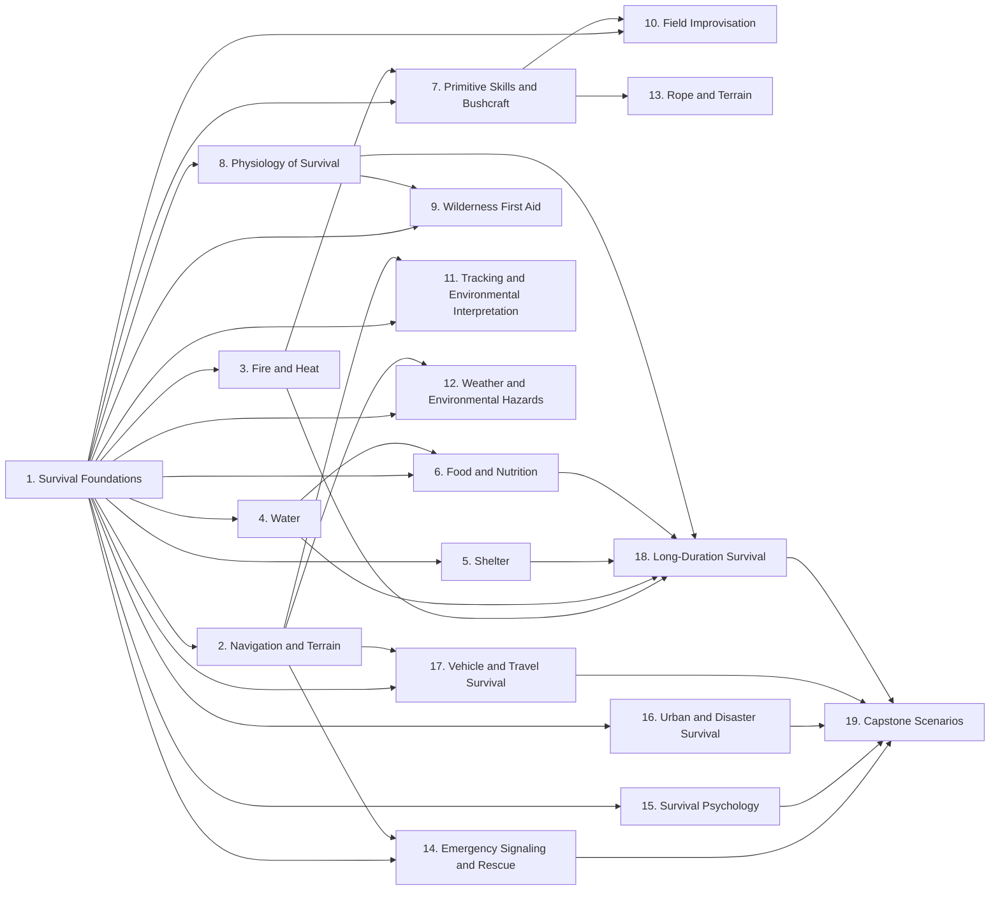
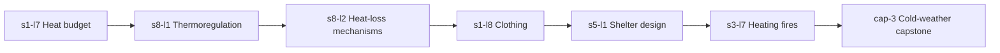

# Prerequisite graph

_Generated from `app/src/content/curriculum.ts`._

## Stage level

(Capstones require every stage; only the last few edges are drawn for readability.)

## Cross-stage lesson dependencies

Edges where a lesson depends on a lesson from a *different* stage — these are the threads that make the course cumulative.

```mermaid
flowchart LR
  s1_l3["s1-l3: Situation assessment: STOP"]
  s2_l1["s2-l1: Maps and scale"]
  s1_l11["s1-l11: Basic fire"]
  s3_l1["s3-l1: Combustion science"]
  s1_l7["s1-l7: Your body’s heat budget"]
  s3_l7["s3-l7: Heating and reflecting"]
  s3_l8["s3-l8: Fire safety, law and impact"]
  s1_l12["s1-l12: Basic water"]
  s4_l1["s4-l1: Water requirements and dehydration"]
  s2_l2["s2-l2: Reading topography"]
  s4_l2["s4-l2: Finding water"]
  s4_l4["s4-l4: Contamination"]
  s1_l10["s1-l10: Basic shelter"]
  s5_l1["s5-l1: Shelter design principles"]
  s5_l2["s5-l2: Site selection in depth"]
  s8_l2["s8-l2: Heat-loss mechanisms quantified"]
  s5_l5["s5-l5: Snow shelters"]
  s6_l1["s6-l1: Energy requirements"]
  s1_l9["s1-l9: Survival equipment and your personal kit"]
  s7_l1["s7-l1: Natural fibers and cordage"]
  s7_l4["s7-l4: Knife and wood tools"]
  s7_l6["s7-l6: Adhesives, charcoal, pigments and smoke"]
  s8_l1["s8-l1: Thermoregulation and core temperature"]
  s8_l5["s8-l5: Hydration and electrolytes"]
  s8_l6["s8-l6: Energy metabolism"]
  s1_l5["s1-l5: Survival mindset and stress"]
  s8_l7["s8-l7: Sleep, fatigue and cognition"]
  s9_l1["s9-l1: Scene safety and the patient assessment system"]
  s8_l3["s8-l3: Hypothermia"]
  s9_l6["s9-l6: Environmental emergencies"]
  s8_l4["s8-l4: Heat stress"]
  s1_l6["s1-l6: Emergency decision making"]
  s10_l1["s10-l1: The improvisation method"]
  s7_l2["s7-l2: Knots and lashings for camp"]
  s10_l3["s10-l3: Frames, tripods and load carrying"]
  s10_l5["s10-l5: Field sanitation and hygiene"]
  s11_l1["s11-l1: Track identification"]
  s11_l5["s11-l5: Reading the landscape for resources"]
  s1_l4["s1-l4: Risk management"]
  s12_l1["s12-l1: Clouds and weather patterns"]
  s12_l3["s12-l3: Flash floods and water crossings"]
  s12_l4["s12-l4: Heat, cold, wind, snow and ice"]
  s12_l6["s12-l6: Avalanches, rockfall and landslides"]
  s13_l1["s13-l1: Rope materials, inspection and care"]
  s1_l13["s1-l13: Emergency signaling"]
  s14_l1["s14-l1: Visual and audible signals"]
  s2_l12["s2-l12: When navigation fails"]
  s14_l3["s14-l3: How searches work"]
  s15_l1["s15-l1: Fear, panic and freezing"]
  s15_l3["s15-l3: Isolation, uncertainty and fatigue"]
  s16_l1["s16-l1: Household emergency planning"]
  s16_l4["s16-l4: Flood, wildfire and extreme weather at home"]
  s17_l1["s17-l1: Vehicle kits and trip planning"]
  s17_l2["s17-l2: Stranded in heat"]
  s17_l3["s17-l3: Stranded in cold and snow"]
  s18_l1["s18-l1: Resource and energy budgeting"]
  s18_l2["s18-l2: Camp systems and sanitation"]
  s10_l4["s10-l4: Repair systems"]
  s18_l3["s18-l3: Maintenance and repair"]
  s18_l4["s18-l4: Sleep, morale and planning ahead"]
  cap_1["cap-1: Lost in a forest"]
  s14_l4["s14-l4: Stay or move"]
  s4_l3["s4-l3: Collecting water"]
  cap_2["cap-2: Desert survival"]
  cap_3["cap-3: Cold-weather survival"]
  s3_l4["s3-l4: Wet-weather fire"]
  s5_l6["s5-l6: Hot-climate and tropical shelters"]
  cap_4["cap-4: Tropical environment"]
  s4_l5["s4-l5: Treatment science"]
  s8_l8["s8-l8: Altitude"]
  cap_5["cap-5: Mountain environment"]
  s9_l9["s9-l9: Monitoring and evacuation decisions"]
  cap_6["cap-6: Injured while hiking"]
  s2_l9["s2-l9: Stars and Moon"]
  cap_7["cap-7: Lost at night"]
  s5_l3["s5-l3: Tarp configurations"]
  cap_8["cap-8: Unexpected overnight stay"]
  cap_9["cap-9: Navigation failure"]
  cap_10["cap-10: Multi-day survival"]
  s15_l4["s15-l4: Leadership and group survival"]
  cap_11["cap-11: Group survival"]
  s16_l5["s16-l5: Utility and communication failure"]
  cap_12["cap-12: Disaster / urban emergency"]
  s1_l3 --> s2_l1
  s1_l11 --> s3_l1
  s1_l7 --> s3_l7
  s1_l11 --> s3_l8
  s1_l12 --> s4_l1
  s2_l2 --> s4_l2
  s1_l12 --> s4_l4
  s1_l10 --> s5_l1
  s2_l2 --> s5_l2
  s8_l2 --> s5_l5
  s1_l7 --> s6_l1
  s1_l9 --> s7_l1
  s1_l9 --> s7_l4
  s3_l1 --> s7_l6
  s1_l7 --> s8_l1
  s4_l1 --> s8_l5
  s6_l1 --> s8_l6
  s1_l5 --> s8_l7
  s1_l3 --> s9_l1
  s8_l3 --> s9_l6
  s8_l4 --> s9_l6
  s1_l6 --> s10_l1
  s7_l2 --> s10_l3
  s4_l4 --> s10_l5
  s1_l3 --> s11_l1
  s4_l2 --> s11_l5
  s1_l4 --> s12_l1
  s2_l2 --> s12_l3
  s8_l2 --> s12_l4
  s2_l2 --> s12_l6
  s7_l2 --> s13_l1
  s1_l13 --> s14_l1
  s2_l12 --> s14_l3
  s1_l5 --> s15_l1
  s8_l7 --> s15_l3
  s1_l4 --> s16_l1
  s12_l3 --> s16_l4
  s1_l9 --> s17_l1
  s8_l4 --> s17_l2
  s8_l3 --> s17_l3
  s6_l1 --> s18_l1
  s8_l6 --> s18_l1
  s10_l5 --> s18_l2
  s10_l4 --> s18_l3
  s15_l3 --> s18_l4
  s2_l12 --> cap_1
  s14_l4 --> cap_1
  s4_l3 --> cap_2
  s8_l4 --> cap_2
  s8_l3 --> cap_3
  s5_l5 --> cap_3
  s3_l4 --> cap_3
  s5_l6 --> cap_4
  s4_l5 --> cap_4
  s8_l8 --> cap_5
  s12_l6 --> cap_5
  s9_l9 --> cap_6
  s2_l9 --> cap_7
  s8_l7 --> cap_7
  s5_l3 --> cap_8
  s3_l7 --> cap_8
  s2_l12 --> cap_9
  s18_l4 --> cap_10
  s15_l4 --> cap_11
  s16_l5 --> cap_12
```

## Example thread (from the brief)

Within each stage, per-lesson prerequisites are listed in [lesson-list.md](lesson-list.md).
