# 01.1 · Thinking like a survivor

A memorised trick only helps in the exact situation it was designed for. A decision system helps in situations nobody wrote a trick for — which is most real emergencies. Research on survival behaviour (Leach; Gonzales) finds that people who adapt their plans to reality, rather than clinging to the original plan, do better. The loop is how you make adapting a habit.

## Explanation

Most people imagine survival as a skills contest: whoever can light a fire with sticks wins. Incident reports tell a different story. People rarely die because they lacked an exotic technique. They die because a **sequence of ordinary decisions** — a late start, a skipped turnaround time, cotton clothing, pushing on in fading light, not telling anyone the route — stacked up until the margin was gone. Then, under stress, cold and darkness, they made one more poor decision.

The skill that matters most is therefore **decision making under pressure**. Techniques matter, but only as options inside a decision.

### The loop

Every situation in this course is worked through the same loop:

1. **Observe** — gather facts: weather, terrain, light, your body, your gear, other people.
2. **Assess** — what do those facts mean? What is dangerous, and how fast is it getting worse?
3. **Prioritize** — which threat will hurt you first or worst? What is the *next highest-value action*?
4. **Plan** — a short, concrete plan with a checkpoint: *"Pitch the tarp in the hollow behind those rocks, then reassess at 17:00."*
5. **Act** — do it, deliberately.
6. **Reassess** — did it work? Has anything changed? Go round again.

*The decision loop. It never stops; the 12 questions feed it.*

The loop deliberately mirrors tools professionals use: land agencies and SAR teams teach **STOP** (Stop, Think, Observe, Plan), wilderness medicine uses a **patient-assessment cycle** that re-checks the patient repeatedly, and military aviators use similar observe–decide–act cycles. Learning one loop well means your reasoning transfers across domains.

### The 12 questions

The loop tells you *how* to think. These questions tell you *what* to think about. Ask them in this order — early questions can override later ones.

| # | Question | Why it sits here |
|---|---|---|
| 1 | Am I in immediate danger? | Rockfall, rising water, traffic, fire, avalanche slope — move first, think second. |
| 2 | What are the major environmental threats? | Cold, heat, wet, wind, altitude, darkness, storms. |
| 3 | Do I have injuries? | Bleeding and breathing problems outrank everything except immediate danger. |
| 4 | Where is my water? | Dehydration degrades judgment and can kill within a day in heat. |
| 5 | What is my temperature risk? | Hypothermia and heat illness are the classic wilderness killers. |
| 6 | Where will I shelter? | Shelter is temperature control plus rest. |
| 7 | How will I communicate? | Being found is usually faster than self-rescue. |
| 8 | Should I stay or move? | One of the most consequential — and least reversible — decisions. |
| 9 | What resources do I have? | Gear, clothing, skills, people, daylight, energy. |
| 10 | What is the biggest risk over the next hour? | Forces short-horizon realism. |
| 11 | What is the biggest risk overnight? | Most survival situations are decided by the first night. |
| 12 | What is my next highest-value action? | **The output.** Everything above feeds this. |

> [!TIP]
> **The key idea**
>
> You will rarely have the time, energy or materials to do everything. Survival is choosing **what to do next**, doing it well, and reassessing — again and again.

## Examples

**Forest, autumn, 16:10.** A day hiker realises the trail they are on is not the one on the map. Observe: 90 minutes of daylight, light drizzle, 9 °C, phone at 40 %, no injuries. Assess: the main threat is getting wet and cold after dark, not being "lost" as such. Prioritize: stop wandering (which adds distance and confusion), try to message, protect from wet. Plan: retrace 10 minutes to the last known junction while there is light; if not found by 16:40, stop and prepare for the night. Act. Reassess at 16:40.

**Desert, midday.** A car breaks down on a remote track at 41 °C. The 12 questions quickly show water and heat as the threats; shelter means *shade*; stay-or-move strongly favours staying with the vehicle, which is far easier to find than a person. The highest-value action is to get out of the sun and reduce sweat — not to start walking.

**City, night.** An earthquake knocks out power. Question 1 (immediate danger) dominates: gas smell, damaged structure, aftershocks. Once safe, the same questions apply — water, temperature, communication, stay or go to a shelter.

## Common mistakes

- Treating survival as a checklist of techniques instead of a sequence of decisions.
- Making a plan once and then executing it blindly — skipping **Reassess**.
- Jumping to a dramatic action (building a fire, starting to walk out) before checking immediate danger, injuries and weather.
- Assuming the environment decides the priorities once and for all; priorities change as the hours pass.

## Practical exercises

### Make your 12-questions card

Level 1 (Knowledge) · 🏠 Home · about 20 min

**Materials:** Index card or phone lock-screen image; Pen; Optional: laminator or clear tape

**Steps**

1. Write the loop (Observe → Assess → Prioritize → Plan → Act → Reassess) on one side.
2. Write the 12 questions on the other side, in order, in your own words.
3. Keep it in your pocket kit or as a phone image that works offline.

**You have it when**

- You can recite the 12 questions from memory, in order.
- The card is in your day pack or pocket kit.

Builds the skill: Run the Observe–Assess–Prioritize–Plan–Act–Reassess loop.

### Case-study debrief

Level 2 (Simulation) · 🏠 Home · about 45 min

**Steps**

1. Find a published incident report (mountain rescue team annual reports, national park SAR summaries, or a chapter of *Deep Survival*).
2. List every decision the people made in time order.
3. Mark the first point where a different decision would have stopped the chain.
4. For that point, answer the 12 questions as they would have looked to the person at that moment.

**You have it when**

- You identified at least three decision points.
- You can explain what the next highest-value action was at the critical point, using only what the person knew then.

Builds the skill: Run the Observe–Assess–Prioritize–Plan–Act–Reassess loop.

## Interactive simulation

[Simulation: Priority Triage](../../simulations/priority-triage/index.html)

Pick the next highest-value action in rapidly changing situations.

## Scenario question

You are hiking alone on a coastal cliff path in late afternoon. A sea mist rolls in fast; visibility drops to 20 m. The path is narrow with a drop on one side. You are warm, dry, uninjured, with a phone at 60 %, water, a jacket and a headlamp.

**What is your next highest-value action?**

1. Keep walking carefully to the car park 3 km ahead before the mist thickens.
2. Move back from the edge, put on your jacket and check your map position.
3. Call emergency services now and report that you are caught in the mist.
4. Sit down where you are and wait for the mist to clear, however long it takes.

Best choice and debrief

**Best: 2.** The loop begins with **immediate danger**: the cliff edge in low visibility. Removing that danger and gathering information (position, time to dark, forecast) costs a few minutes and keeps every option open. Calling for help or waiting are both valid *after* assessment — that is the point: decide from facts, not from the first impulse.

- **1.** Moving along a cliff edge in 20 m visibility adds a serious fall risk to an otherwise stable situation.
- **2.** Best: it removes the immediate danger (edge), protects against the damp, and gathers facts before committing.
- **3.** Reasonable if you cannot move safely — but you have not yet assessed whether you can.
- **4.** Waiting may become the right choice, but deciding without checking position, time and weather is premature.

## Summary

- Emergencies usually grow from chains of small, ordinary decisions.
- The loop — **Observe → Assess → Prioritize → Plan → Act → Reassess** — is repeated, never done once.
- The 12 questions are ordered: immediate danger and injuries first; the output is the **next highest-value action**.
- This course teaches mechanisms and trade-offs so you can reason about situations no list anticipates.

## Further reading

- Laurence Gonzales. *Deep Survival: Who Lives, Who Dies, and Why*. 2003. Narrative synthesis of case studies and neuroscience. Journalism, not research — but widely used by trainers.
- John Leach. *Survival Psychology*. 1994. Academic foundation for disaster-behavior patterns, by a former RAF survival instructor.
- The Mountaineers. [Mountaineering: The Freedom of the Hills (10th ed.)](https://www.mountaineers.org/books/books/mountaineering-the-freedom-of-the-hills-10th-edition). The standard mountaineering text since 1960, revised by committee.

## References

- Laurence Gonzales. *Deep Survival: Who Lives, Who Dies, and Why*. 2003. Narrative synthesis of case studies and neuroscience. Journalism, not research — but widely used by trainers.
- John Leach. [Why people “freeze” in an emergency: temporal and cognitive constraints on survival responses](https://eprints.lancs.ac.uk/id/eprint/18753/). 2004. Aviation, Space, and Environmental Medicine 75(6):539–542.
- US Army. [ATP 3-50.21 Survival (supersedes FM 3-05.70 / FM 21-76)](https://armypubs.army.mil/ProductMaps/PubForm/Details.aspx?PUB_ID=1005316). 2018. Current public US survival doctrine. Written for military contexts — use with judgment.
- NOLS. [NOLS expeditions and leadership courses](https://www.nols.edu/).
- Robert J. Koester. [Lost Person Behavior](https://www.dbs-sar.com/LostPersonBehavior.htm). 2008. Statistical profiles of how lost people behave (ISRID, >145,000 incidents). Used by SAR planners worldwide.
