# 01.4 · Risk management

Rescue is often measured in hours to days, and it starts only when someone knows you are missing and where to look. Risk management — especially trip plans and turnaround times — shortens that delay or removes the emergency entirely.

## Explanation

The best survival situation is the one that never happens. Professionals spend far more effort **preventing** emergencies than surviving them. Risk management is that prevention, done systematically.

### Hazard vs risk

- A **hazard** is something that can cause harm: a river, a cliff, lightning, cold.
- **Risk** is how likely that harm is *and* how bad it would be, given what you are doing.

A river is a hazard. Crossing it in spate at thigh depth is a high risk; walking beside it on a good path is a low one.

*A 5 × 5 risk matrix. Scores are rough; the value is in forcing you to think about both axes.*

### Controls

For each significant risk, choose controls — ideally several, because each can fail:

1. **Avoid** — choose a different route, day or objective.
2. **Reduce likelihood** — start earlier, check the forecast, carry a map, go with a partner.
3. **Reduce consequence** — carry a first-aid kit, emergency shelter, a satellite messenger; leave a trip plan.
4. **Accept** — knowingly, with a decision point where you will reconsider.

### Decision points and turnaround times

A **turnaround time** is a time, set *before* you start, at which you turn back regardless of where you are. It exists because, once you are invested, your judgment about "just a bit further" is unreliable. Good turnaround times are based on:

- time to get back to safety **plus a margin** (at least 25 %),
- daylight, weather forecast, and the slowest member of the group.

Write it down. Tell your partner. Treat it as a commitment, not a suggestion.

### FACETS: how good people make bad decisions

Avalanche researcher Ian McCammon analysed accidents and found that experienced people repeatedly fell into the same **heuristic traps** — mental shortcuts that are normally helpful. They apply to every outdoor decision:

| Trap | What it sounds like |
|---|---|
| **F**amiliarity | "I've done this route a dozen times." |
| **A**cceptance | Wanting to be seen as capable by the group. |
| **C**onsistency / commitment | "We've come this far; we planned this for months." |
| **E**xpert halo | "She's the experienced one; she must know it's fine." |
| **T**racks / scarcity | "Someone else went this way" / "This is our only chance this year." |
| **S**ocial facilitation | Taking more risk because others are watching or present. |

Naming the trap out loud ("Is this commitment talking?") is surprisingly effective.

### The trip plan

A trip plan converts "nobody knows where I am" into "people will look for me, in the right place, at the right time". It is the single most valuable consequence-reducing control. It contains:

- who is going, with descriptions (clothing colours help searchers), vehicle and registration;
- route, alternatives, and where you plan to camp;
- start time, **expected return time**, and **the time at which your contact should call for help**;
- what you carry (shelter, communication devices, medical kit);
- the number to call (local emergency number, park authority).

Leave it with a responsible person, not just on social media.

## Scientific and technical background

### Small risks compound with exposure

Suppose an activity carries a probability $p$ of an incident per hour, independently each hour. Over $n$ hours the chance of *at least one* incident is

$$
P = 1 - (1 - p)^n
$$

Intuition: each hour you "survive" only with probability $1-p$, and those survivals multiply. With $p = 1\%$ and $n = 10$: $1 - 0.99^{10} \approx 9.6\%$. Doubling exposure time nearly doubles the risk. That is why **reducing time in the hazard** (a faster crossing, an earlier start, a shorter route across the avalanche slope) is such a powerful control.

## Examples

**Mountain day hike.** Hazard: afternoon thunderstorms. Controls: start at dawn, summit by 11:00, turnaround 11:30, route with a lower escape option, check the forecast the night before and the sky every hour.

**Desert.** Hazard: heat, vehicle breakdown. Controls: travel in the cooler hours, carry at least double the water you expect to need, tell someone your route and return time, carry a satellite messenger.

**Coastal.** Hazard: tide cutting off a beach walk. Controls: check tide tables, identify exit points, set a turnaround time relative to low tide.

**Urban.** Hazard: power outage in winter. Controls: stored water, alternative heating that does not produce indoor CO, battery lighting, a family communication plan.

## Common mistakes

- Rating only likelihood ("it probably won’t happen") and ignoring consequence.
- Setting a turnaround time and then negotiating with it on the day.
- Leaving a vague trip plan ("going hiking in the national park") or none at all.
- Relying on a single control — one phone, one light, one route option.
- Believing experience makes you immune: FACETS traps catch experts most.

## Practical exercises

### Write and use a real trip plan

Level 3 (Safe physical) · 🏠 Home · about 30 min

**Steps**

1. Choose a real walk you will do in the next month.
2. Write a trip plan using the checklist in this lesson, including the time your contact should raise the alarm.
3. Give it to a responsible person and brief them on what to do.
4. After the walk, check in on time — and tell your contact you are back.

**You have it when**

- Your contact can tell you, unprompted, when and whom to call.
- You checked in on time.

Builds the skill: Trip plan and check-in system.

### Risk-matrix a planned day

Level 2 (Simulation) · 🏠 Home · about 30 min

**Steps**

1. List at least 6 hazards for a planned trip (weather, terrain, water, darkness, health, navigation…).
2. Score each for likelihood and consequence (1–5).
3. For any score ≥ 8, add at least two controls.
4. Set a turnaround time with a 25 % margin.
5. Identify which FACETS trap is most likely to affect *you* on this trip.

**You have it when**

- Every high risk has at least two independent controls.
- Your turnaround time is written down and shared.

Builds the skill: Risk assessment of a planned trip.

## Scenario question

You are leading two friends up a popular mountain. Your turnaround time is 12:00. At 11:50 you are 20 minutes below the summit. The sky to the west is darkening. Another group passes you going up, laughing. Your friends really want the summit.

**What is the best decision?**

1. Continue — 20 minutes is close, and the other group is going.
2. Turn around at 12:00 as planned, and say why out loud.
3. Send the fittest friend up alone while the others wait.
4. Extend the turnaround to 12:30 and reassess.

Best choice and debrief

**Best: 2.** Turnaround times are pre-commitments made by your calmer self. The darkening sky is evidence *for* the plan, not against it. Naming the FACETS traps out loud (“is this commitment talking?”) helps a group accept the decision.

- **1.** This is commitment + tracks + social facilitation all at once.
- **2.** Best: the turnaround time was set when your judgment was not under pressure, and the sky supports it.
- **3.** Splits the group and puts one person alone at the most exposed place at the worst time.
- **4.** Renegotiating a turnaround time under pressure is exactly what turnaround times are designed to prevent.

## Summary

- Risk = likelihood × consequence; hazards are just sources of harm.
- Exposure time compounds risk: $P = 1-(1-p)^n$.
- Layer controls: avoid, reduce likelihood, reduce consequence, accept knowingly.
- Set turnaround times in advance and keep them. Name the **FACETS** traps.
- A trip plan with a clear alarm time is your best consequence control.

## Further reading

- Ian McCammon. *Heuristic traps in recreational avalanche accidents: evidence and implications*. 2004. Avalanche News 68. Source of the FACETS human-factor traps; applies well beyond avalanches.
- The Mountaineers. [Mountaineering: The Freedom of the Hills (10th ed.)](https://www.mountaineers.org/books/books/mountaineering-the-freedom-of-the-hills-10th-edition). The standard mountaineering text since 1960, revised by committee.

## References

- Ian McCammon. *Heuristic traps in recreational avalanche accidents: evidence and implications*. 2004. Avalanche News 68. Source of the FACETS human-factor traps; applies well beyond avalanches.
- The Mountaineers. [Mountaineering: The Freedom of the Hills (10th ed.)](https://www.mountaineers.org/books/books/mountaineering-the-freedom-of-the-hills-10th-edition). The standard mountaineering text since 1960, revised by committee.
- Ready.gov (FEMA). [Make a Plan](https://www.ready.gov/plan).
- Robert J. Koester. [Lost Person Behavior](https://www.dbs-sar.com/LostPersonBehavior.htm). 2008. Statistical profiles of how lost people behave (ISRID, >145,000 incidents). Used by SAR planners worldwide.
- Mountain Training (UK). [Hill and Moorland Leader qualification](https://www.mountain-training.org/qualifications/walking/hill-and-moorland-leader/). Train → consolidate (logged days) → assess: the model for this course’s practice logs.
