# 01.12 · Basic water

Dehydration is fast in heat, subtle in cold, and degrades the judgment you need for every other decision. Contaminated water can turn a survival situation into a medical one days later. Water planning and treatment are basic hygiene for every trip.

## Explanation

### How much water do you need?

The US Institute of Medicine sets adequate **total** water intake (drinks + food) at about **3.7 L/day for men** and **2.7 L/day for women** in temperate conditions — roughly 80 % from drinks. On top of that come **sweat losses**, which vary enormously:

| Situation | Typical sweat rate |
|---|---|
| Resting in shade, mild | ~0.1 L/h |
| Walking in mild weather | 0.3–0.6 L/h |
| Hiking uphill in heat | 0.8–1.5 L/h |
| Hard work in desert sun | 1–2+ L/h |

A useful planning model: **baseline ≈ 2–3 L/day + sweat rate × hours active**. Heat, altitude, cold dry air (you lose water breathing) and illness all raise the need.

### Dehydration

Losing about **2 % of body mass** as water measurably degrades endurance and thinking. Signs: thirst, dark and scanty urine, headache, fatigue, dizziness on standing, irritability. Severe dehydration leads to confusion, rapid pulse and collapse — and makes heat illness and hypothermia more likely.

**Ration sweat, not water.** Hoarding water while you sweat it away achieves nothing — the water is more useful inside you. Instead, *reduce losses*: rest in shade during the heat of the day, move in the cool hours, keep clothing on in desert sun, breathe through the nose, don’t eat much if water is very short (digestion uses water).

### Sources, from usually safer to riskier

1. **Rain and fresh snowmelt** collected on clean surfaces — usually low in pathogens.
2. **Springs** emerging directly from rock — often good, but not guaranteed.
3. **Fast-flowing streams** high in the catchment, above people and livestock.
4. **Large lakes**, collected away from the shore.
5. **Slow rivers** downstream of farms, settlements or roads.
6. **Stagnant pools, puddles, cattle troughs** — high risk; also possible **algal toxins** (green scum or paint-like films — avoid entirely).

**Chemical contamination** (mines, agriculture, industry, flood water) is *not* removed by boiling, chlorine or most filters. Clear, cold and fast-flowing water can still carry Giardia or Cryptosporidium. **Treat all wild water** unless you have strong reasons not to.

*What each method handles. Combine methods for broad coverage.*

### Treatment methods

- **Boiling** — the gold standard for pathogens. Bring to a **rolling boil for 1 minute**; **3 minutes above about 2,000 m (6,500 ft)**, per the US CDC. Costs fuel and time; does not remove chemicals.
- **Chlorine (unscented household bleach or tablets)** — kills bacteria and viruses; weak against Giardia and **ineffective against Cryptosporidium**. CDC emergency guidance: for 6 % bleach, about **8 drops per gallon (≈2 drops per litre)**; double for cloudy or very cold water; wait **30 minutes**; there should be a slight chlorine smell.
- **Chlorine dioxide tablets/drops** — broader: bacteria, viruses, Giardia; Cryptosporidium with longer contact (often **4 hours** — follow the product instructions).
- **Filters** — hollow-fibre or ceramic filters rated **0.1–0.2 µm** remove bacteria and protozoa but generally **not viruses**. Some "purifiers" also remove viruses. Filters clog in turbid water.
- **UV pens** — effective against all pathogen classes **in clear water**; shadows from particles protect microbes. Needs batteries.

**Pre-treat turbid water:** let it settle, then pour it through a cloth or bandana. Clearer water makes every method work better.

**Belt and braces:** filter + chemical, or filter + UV, covers the gaps of each.

**Store safely:** clean containers with lids; don’t dip hands or cups into treated water; keep treated and untreated containers (and their threads) separate.

> [!WARNING]
> **Do not drink**
>
> Seawater, urine, blood, alcohol, or water with algal scum. Seawater and urine add salt your kidneys must excrete using more water than they provide. Alcohol increases fluid loss and impairs judgment and thermoregulation.

## Scientific and technical background

### Why chlorine needs time: the CT concept

Chemical disinfection depends on **concentration × contact time** ($CT$, in mg·min/L). A pathogen needs a certain $CT$ to be inactivated. Lower the concentration (or make the water colder, which slows the chemistry) and you need proportionally longer. Cryptosporidium’s tough oocyst wall needs a $CT$ for chlorine far beyond what is practical to drink — hence "ineffective".

### Estimating a day’s need

Total drinking need ≈ baseline + (sweat rate × active hours).

Example: baseline 2.5 L; 6 hours hiking at 0.7 L/h:
$2.5 + 0.7 \times 6 = 6.7$ L. In a desert at 1.2 L/h for the same hours: $2.5 + 7.2 = 9.7$ L. Planning without the sweat term is how people run out.

## Examples

**Mountain stream above a cattle pasture:** looks perfect, likely contaminated. Filter + chemical, or boil.

**Desert:** water is the limiting resource. Carry far more than seems necessary, travel in cool hours, and note that desert water sources (tinajas, seeps) may be stagnant and shared with animals.

**Subarctic:** snow is everywhere, but melting it costs fuel; do not eat snow (it cools you). Melt a little water in the pot first, then add snow, to avoid scorching.

**Coastal:** surrounded by undrinkable water; collect rain on a tarp.

**Urban emergency:** the tap may run but be contaminated after a flood or earthquake; follow boil-water notices. Stored water and the hot-water tank are reserves (Stage 16).

## Common mistakes

- Hoarding water while sweating heavily — ration sweat, not water.
- Assuming clear, cold, fast water is safe.
- Relying on chlorine alone where Cryptosporidium is a concern.
- Using a filter as if it removes viruses or chemicals.
- Contaminating treated water with untreated drips on bottle threads or dirty hands.
- Eating snow instead of melting it.

## Practical exercises

### Measure your water turnover

Level 3 (Safe physical) · 🏠 Home · about 30 min

**Materials:** Bathroom scale (±0.1 kg ideally); Water bottle with volume marks

**Steps**

1. Weigh yourself (minimal clothing) before and after a one-hour walk or workout. Note how much you drank during it.
2. Sweat loss ≈ weight before − weight after + water drunk (1 kg ≈ 1 L).
3. Repeat in different weather. Build your personal table of sweat rates.

**You have it when**

- You have at least two measured sweat rates.
- You can compute a day’s water plan for a trip from your own numbers.

Builds the skill: Treat water with two methods.

### Treat water two ways

> [!WARNING]
> **Home.** Safe to do at home or at a desk.
>
> Use only unscented bleach intended for disinfection; check its concentration on the label. Do this with tap water for practice.

Level 3 (Safe physical) · 🏠 Home · about 45 min

**Materials:** Pot and stove/kettle; Unscented household bleach or purification tablets; Dropper; Clean bottles; Cloth

**Steps**

1. Pre-filter a litre of (tap) water through a cloth to practise the technique.
2. Boil a litre at a rolling boil for 1 minute; let it cool covered.
3. Chemically treat a litre using the dose on your product or the CDC bleach table; wait the full contact time.
4. Write the dosing arithmetic for 1 L, 2 L and 1 gallon on your kit card.

**You have it when**

- Both methods done with correct time/dose.
- Dosing table written on your kit card.

Builds the skill: Treat water with two methods.

## Interactive simulation

[Simulation: Water Safety Simulator](../../simulations/water-treatment/index.html)

Pick a source and a treatment chain; see the remaining risk.

## Scenario question

You are on a 3-day trek. Day 2, 13:00, 32 °C. You have 0.5 L left and a 0.2 µm filter; your chlorine tablets were lost. Options: (1) a clear, fast stream 10 minutes away that flows through a village 2 km upstream; (2) a stagnant, greenish pool right here; (3) wait for a forecast thunderstorm at 17:00 to collect rain on your tarp.

**What is the best plan?**

1. Filter water from the green pool right here — it is the closest source.
2. Go to the stream, settle and filter, boil at camp, and set the tarp for rain.
3. Save your 0.5 L and wait in the shade for the 17:00 storm to collect rain.
4. Drink straight from the stream, since clear, fast-flowing water is clean.

Best choice and debrief

**Best: 2.** Pick the lowest-risk source you can reach, then match treatment to the likely hazards: a filter handles bacteria and protozoa; a village upstream means viruses too — boiling (if you have a stove) covers them. Rain collection is a free extra. Avoid algal water entirely. Don’t ration water in heat.

- **1.** Green scum may indicate algal toxins, which filters do not reliably remove.
- **2.** Best: a lower-risk source, filter for bacteria/protozoa, boiling covers viruses from the village, and rain is a bonus.
- **3.** Rationing water in 32 °C heat while waiting on an uncertain forecast is risky.
- **4.** A village upstream means likely viral and bacterial contamination.

## Summary

- Need ≈ baseline 2–3 L/day **plus** sweat (0.3–2 L/h).
- Ration sweat, not water. Dehydration degrades judgment before it threatens life.
- Treat all wild water. Boil 1 min (3 min above ~2,000 m).
- Chlorine misses Crypto; filters miss viruses; UV needs clear water; nothing common removes chemicals.

## Further reading

- US Centers for Disease Control and Prevention. [How to Make Water Safe in an Emergency](https://www.cdc.gov/water-emergency/about/index.html). Rolling boil 1 min (3 min above 6,500 ft / ~2,000 m); bleach dosing and 30-min contact.
- Backer HD, Derlet RW, Hill VR. *WMS Clinical Practice Guidelines for Water Disinfection for Wilderness, International Travel, and Austere Situations*. 2019. Wilderness & Environmental Medicine 30(4S):S100–S120.

## References

- Institute of Medicine (US National Academies). [Dietary Reference Intakes for Water, Potassium, Sodium, Chloride, and Sulfate](https://nap.nationalacademies.org/catalog/10925/dietary-reference-intakes-for-water-potassium-sodium-chloride-and-sulfate). 2005. Adequate intake ≈3.7 L/day (men) and 2.7 L/day (women) total water, from all sources.
- Sawka MN, Burke LM, Eichner ER, et al.. *ACSM Position Stand: Exercise and Fluid Replacement*. 2007. Medicine & Science in Sports & Exercise 39(2):377–390. Sweat rates of ~0.5–2 L/h.
- US Centers for Disease Control and Prevention. [How to Make Water Safe in an Emergency](https://www.cdc.gov/water-emergency/about/index.html). Rolling boil 1 min (3 min above 6,500 ft / ~2,000 m); bleach dosing and 30-min contact.
- US Environmental Protection Agency. [Emergency Disinfection of Drinking Water](https://www.epa.gov/ground-water-and-drinking-water/emergency-disinfection-drinking-water).
- Backer HD, Derlet RW, Hill VR. *WMS Clinical Practice Guidelines for Water Disinfection for Wilderness, International Travel, and Austere Situations*. 2019. Wilderness & Environmental Medicine 30(4S):S100–S120.
- World Health Organization. [Guidelines for Drinking-water Quality (4th ed. with addenda)](https://www.who.int/publications/i/item/9789241548151).
