# 03.8 · Fire safety, law and impact

Most wildfires are started by people — escaped campfires, sparks, carelessness. One unextinguished fire can burn homes and forests and kill firefighters. CO poisoning kills campers and disaster survivors every year. Knowing when not to light, and how to put a fire out cold, is the most important fire skill of all.

## Explanation

Every other lesson in this stage is about making fire work. This one is about making sure your fire never becomes the emergency: a wildfire, a burn, a poisoning, or a scar on the land. The rules are simple; the discipline is in applying them every time.

### 1. Is a fire allowed here, today?

Fire law depends on **country, region, land manager and season** — and changes quickly:

- **Designated rings only:** many parks allow fires only in provided fire rings or grills.
- **Seasonal restrictions and bans:** for example, US national forests post “Stage 1/Stage 2” restrictions; Australian states declare **Total Fire Ban** days; Swedish counties issue fire bans (*eldningsförbud*); Canadian provinces post bans for Crown land. Bans can start the same day and often include charcoal and sometimes stoves.
- **Access codes:** Scotland’s Outdoor Access Code discourages fires in many settings and they are banned in some camping-management zones; in England and Wales you generally need the landowner’s permission.
- **Liability:** in many jurisdictions whoever starts a wildfire — even accidentally — can be fined, prosecuted, or billed for suppression costs.

**How to check:** the land manager’s website or office (park, forest, county, landowner) on the day, plus the national fire-danger service (e.g., NIFC in the US, the Canadian Wildland Fire Information System, the European Forest Fire Information System). The References page lists portals by country.

> [!IMPORTANT]
> **Law varies — the rule of this course**
>
> Only light practice fires where it is explicitly legal and no restriction is in force. In a genuine life-threatening emergency, a small, controlled fire for warmth or signalling may be justified — but you remain responsible for keeping it safe and putting it out.

*Site, clearance, water ready — and never in enclosed spaces.*

### 2. Fire weather: when not to light at all

Wildfires spread fastest when it is **hot, dry and windy with low humidity**, on **slopes** (fire races uphill) and in **fine, dry fuels** (grass, needles). Warning signs:

- Strong or gusty wind; sparks and embers can travel hundreds of metres ahead of a wildfire.
- Low relative humidity. Wildland firefighters watch the **“crossover”**: when the air temperature in °C rises above the relative humidity in %, fire behaviour can become extreme.
- Cured (dry, yellow) grass; crunchy leaf litter; recent drought.
- An official fire-danger rating of high or above.

In those conditions, use a stove (if allowed) or go without. A cold dinner is not an emergency.

### 3. Site, size, supervise

- Use an **existing fire ring** where there is one. Otherwise bare mineral soil or rock, **≥ 3 m** cleared of flammable material, away from overhanging branches, tents, roots, **peat and deep duff** (fire can smoulder underground for days and re-emerge).
- Keep it **as small as does the job** and **never leave it unattended** — not even for a few minutes.
- Keep water (several litres) or a shovel of mineral soil ready **before** you light.

### 4. Extinguish: cold to the touch

**Drown, stir, feel.** Pour water on the fire until the hissing stops; stir the ashes and embers with a stick to expose hidden hot spots; pour again; stir again; then feel with the back of your hand held just above, then near the ashes. **If it is too hot to touch, it is too hot to leave.**

With little water: separate the embers, let the fire burn down to ash, mix in **mineral soil** (not leaves or duff) and stir, repeat, and check by hand. Do **not** simply bury a fire: buried coals can stay hot for many hours, ignite roots, or burn someone who steps there.

### 5. Carbon monoxide: the invisible hazard

Incomplete combustion makes **carbon monoxide (CO)**, a colourless, odourless gas that binds to haemoglobin far more strongly than oxygen. Every year people die in **tents, snow shelters, vehicles, cabins and basements** from stoves, barbecues, charcoal, fires and generators used indoors — including after disasters when power is out.

- **Never** burn a fire, charcoal or barbecue (even a “cooling” one) in a tent, snow cave, vehicle or closed room. Never run a generator indoors or near windows.
- If you must use a stove in a vestibule or snow shelter in severe conditions, ventilate generously and keep a vent hole open; many experts advise never doing so.
- **Symptoms:** headache, dizziness, weakness, nausea, confusion, sleepiness — easily mistaken for fatigue, altitude or cold. Everyone in the shelter feeling ill at once is a red flag.
- **Action:** get everyone into fresh air immediately and call emergency services.

### 6. Leave No Trace

- Consider whether you need a fire; a stove is lighter on the land.
- Use existing rings; keep fires small; burn only **dead and down** wood no thicker than a wrist, gathered widely.
- Burn wood completely to ash, put it out cold, scatter cool ash (where appropriate), and pack out any rubbish — food waste and foil do not burn away.
- Where you had to make a new fire site, restore it: return soil and cover, so the next person does not reuse it.

[Simulation: Advanced Fire Builder](../../simulations/fire-advanced/index.html)

Try “very windy” weather or leaf-litter placement: watch the safety risk and the score fall regardless of how well the fire lights.

## Scientific and technical background

### Why wind and slope accelerate fire

A fire spreads by heating the fuel ahead of it to ignition. Wind and slope both **tilt the flames toward the unburned fuel**, so radiation and hot gases preheat it far more strongly; wind also supplies oxygen and carries burning embers (“spotting”) ahead of the front. On an upslope, the fuel above is already bathed in the rising plume. That is why a campfire’s sparks in gusty, dry weather are so dangerous, and why wildfire safety advice is to move **away from and across** slopes, not uphill ahead of a fire.

### Why dry, fine fuels matter

Lesson 1 again: fine fuels (grass, needles) have enormous surface-to-volume ratios, and in dry weather their moisture follows the air’s humidity within hours. Low humidity means fine fuels dry out fast and ignite from a single spark.

### How much water to put a fire out?

Water absorbs about **2.6 MJ per kg** heating from 15 °C and evaporating (0.35 MJ to warm to 100 °C, plus 2.26 MJ to boil). A bed of glowing coals and hot ash from a small campfire can easily hold a few megajoules. Example: 5 kg of hot coals and ash at ~500 °C, specific heat ~1 kJ/(kg·°C), cooling to ~50 °C releases

$$
5 \times 1 \times 450 \approx 2250\ \text{kJ} \approx 2.3\ \text{MJ}
$$

— roughly **1 litre of water fully evaporated**, and in practice several litres, because much of the water runs off without boiling. That is why “a splash from the bottle” is not enough: drown, stir, and drown again.

### Carbon monoxide

CO forms when carbon burns without enough oxygen: $2\text{C} + \text{O}_2 \rightarrow 2\text{CO}$ instead of $\text{C} + \text{O}_2 \rightarrow \text{CO}_2$. Smouldering fires, charcoal and stove flames in a closed space are exactly those conditions. CO binds to haemoglobin roughly 200–250 times more strongly than oxygen, so even low concentrations in air steadily displace oxygen from your blood.

## Examples

**Mediterranean scrub, August:** hot, dry, windy afternoons, cured grass and resinous shrubs — fire bans are common and a single spark can start a large fire. Use no fire at all.

**Australian bush:** Total Fire Ban days prohibit open fires, and often other spark-making activities; rules and ratings are set by state fire services.

**Boreal peatland (Canada, Scandinavia, Siberia):** fires can burrow into peat and smoulder underground for weeks — “zombie fires” have even survived winter under the snow. Never build fires on peat or deep moss.

**US national forest, summer:** Stage 1 restrictions may allow fires only in developed campground rings; Stage 2 bans all campfires. Checking the forest’s alert page is part of trip planning.

**Arctic camp:** a stove in a tent vestibule for melting snow in a storm — the scenario behind many CO incidents. Ventilate hard, keep the vent open, never sleep with it running.

**Urban power cut:** a charcoal barbecue brought indoors “just to warm the flat”, or a generator in the garage, are leading causes of CO deaths after storms.

## Common mistakes

- Assuming no posted sign means fires are allowed — bans are often posted only online.
- Leaving a fire “for just a minute” to fetch water or wood.
- Burying a fire under soil instead of drowning and stirring it — buried coals stay hot for hours.
- Myth: “If it isn’t smoking, it’s out.” — Coals under ash can be hot with no visible smoke. Feel it.
- Myth: “A little ventilation makes a charcoal grill or stove safe inside a tent.” — CO still accumulates; do not do it.
- Building a fire on peat, deep moss or duff, or against tree roots.
- Lighting on a hot, dry, windy afternoon because “it’s only small”.

## Practical exercises

### Fire-rules research for three trips

Level 1 (Knowledge) · 🏠 Home · about 40 min

**Steps**

1. Pick three places you might visit — ideally in different countries or land types (national park, state/regional forest, private farmland).
2. Find the land manager and the current rules: are fires allowed? Only in rings? Seasonal bans? Stoves?
3. Find where bans are announced (website, phone line, app) and the current fire-danger rating.
4. Write a one-line rule for each place and add the check to your trip-plan template (Stage 1).

**You have it when**

- Three sets of rules with their source links.
- Your trip plan now includes a same-day fire-rules check.

Builds the skill: Trip plan and check-in system.

### Drown-stir-feel drill

> [!WARNING]
> **Outdoor.** Outdoors with ordinary care. A partner is recommended.
>
> Only where fires are explicitly permitted and no fire ban is in force. Stand back from steam when pouring onto hot coals.

Level 3 (Safe physical) · 🌲 Outdoor · about 45 min

**Materials:** Legal fire pit or barbecue; Small fire; Measured water (e.g., 5 L in 1 L bottles); Stick for stirring

**Steps**

1. Let a small fire burn down to coals.
2. Extinguish with drown–stir–feel. Count how many litres you needed until the ashes are cold to the touch.
3. Note where hot spots hid (under logs, at the edges, deep in the ash).

**You have it when**

- Ashes cold to the touch everywhere.
- You know how much water your usual fire needs.

Builds the skill: Light and manage a fire with lighter and ferro rod.

### CO check for your gear and home

Level 1 (Knowledge) · 🏠 Home · about 20 min

**Steps**

1. List every combustion device you own (stove, lantern, heater, barbecue, generator, vehicle).
2. For each, write where you would use it in an emergency and how you would keep CO away from sleeping people.
3. Check you have a working battery CO alarm at home (and consider a small one for cabins or vans).

**You have it when**

- A written rule for each device.
- A tested CO alarm at home.

Builds the skill: Household emergency plan and kit.

## Scenario question

Late summer, dry pine forest on a hillside, 31 °C, relative humidity 22 %, gusty wind. You are on a planned overnight; the park allows fires in designated rings, and your campsite has one. No ban was posted at the trailhead. Your group wants a campfire.

**What do you do?**

1. Light a small fire in the ring, since it is allowed and you will watch it closely.
2. Check current restrictions, skip the fire tonight, and cook on a valve stove if permitted.
3. Light a Dakota hole instead, so the sparks stay contained below ground level.
4. Light the fire, but keep a full water bottle right next to it all evening.

Best choice and debrief

**Best: 2.** The crossover (31 °C > 22 % RH), gusty wind, a slope and dry pine needles are textbook extreme-fire conditions. Bans may already be in force online. Even where legal, the right call is no open fire. Use judgment beyond the minimum rule — and remember that escaped fires can bring prosecution and suppression costs, and cost lives.

- **1.** Legal is not the same as safe: these are extreme fire-weather conditions.
- **2.** Best: temperature above humidity, gusts and a slope with dry pine = extreme risk. Keep the stove well away from dry fuel.
- **3.** Digging on a dry, rooty pine slope can ignite roots; and any fire tonight is a bad idea.
- **4.** A bottle cannot stop an ember carried 50 m by a gust into dry needles.

## Summary

- Fire rules depend on land manager, season and day — check at the source every trip; practise only where legal.
- Hot, dry, windy, low humidity (temperature above humidity), fine dry fuel, slopes: do not light.
- Existing rings, ≥ 3 m clearance, small, never unattended; extinguish by drown, stir, feel — never just bury.
- CO is invisible and odourless: no fires, charcoal, stoves or generators in tents, snow shelters, vehicles or closed rooms.
- Leave No Trace: stove first, small fires, dead-and-down wood, burn to ash, restore the site.

## Further reading

- USDA Forest Service / Smokey Bear. [Campfire Safety](https://smokeybear.com/en/prevention-how-tos/campfire-safety).
- Leave No Trace Center for Outdoor Ethics. [The Seven Principles of Leave No Trace](https://lnt.org/why/7-principles/).
- Ready.gov (FEMA). [Wildfires](https://www.ready.gov/wildfires).
- US Centers for Disease Control and Prevention. [Carbon Monoxide Poisoning Basics](https://www.cdc.gov/carbon-monoxide/about/index.html). Sources, symptoms and prevention, including camp stoves and generators.

## References

- USDA Forest Service / Smokey Bear. [Campfire Safety](https://smokeybear.com/en/prevention-how-tos/campfire-safety).
- USDA Forest Service. [Know Before You Go: Fire](https://www.fs.usda.gov/visit/know-before-you-go/fire).
- US National Park Service. [Fire](https://www.nps.gov/subjects/fire/index.htm). Each park’s Superintendent’s Compendium lists local fire rules.
- [National Interagency Fire Center](https://www.nifc.gov/).
- [National Wildfire Coordinating Group — fire behavior standards](https://www.nwcg.gov/).
- Natural Resources Canada. [Canadian Wildland Fire Information System](https://cwfis.cfs.nrcan.gc.ca/home). National fire-danger and fire-weather maps.
- Copernicus Emergency Management Service / European Commission JRC. [European Forest Fire Information System (EFFIS)](https://forest-fire.emergency.copernicus.eu/). Fire-danger forecasts and current fires across Europe, the Middle East and North Africa.
- NatureScot. [Scottish Outdoor Access Code](https://www.outdooraccess-scotland.scot/). Statutory guidance on responsible access, wild camping and fires in Scotland.
- Ready.gov (FEMA). [Wildfires](https://www.ready.gov/wildfires).
- US Centers for Disease Control and Prevention. [Carbon Monoxide Poisoning Basics](https://www.cdc.gov/carbon-monoxide/about/index.html). Sources, symptoms and prevention, including camp stoves and generators.
- US Consumer Product Safety Commission. [Carbon Monoxide Information Center](https://www.cpsc.gov/Safety-Education/Safety-Education-Centers/Carbon-Monoxide-Information-Center). Generators, CO alarms and symptoms.
- Leave No Trace Center for Outdoor Ethics. [The Seven Principles of Leave No Trace](https://lnt.org/why/7-principles/).
- US Environmental Protection Agency. [Burn Wise](https://www.epa.gov/burnwise). Wood smoke, health, and burning dry wood cleanly.
