# 04.5 · Treatment science

Every method has a hole: chlorine and Crypto, filters and viruses, UV and cloudy water, boiling and fuel and chemicals. The science tells you exactly where the holes are and how big they become in cold, murky water — so you can stack methods whose holes don’t overlap, set the right dose and time, and stop wasting fuel on ritual.

## Explanation

Treatment either **removes** organisms (settling, coagulation, filtration) or **inactivates** them (heat, chemicals, UV). Every method is described by *how much* it reduces each pathogen class, in **logs**.

### Log reductions

One log = a **10-fold** reduction = 90 % removed. Two logs = 99 %. Four logs = 99.99 %. Logs let you see what percentages hide: 99 % sounds excellent, but if the water carried 10,000 viruses per litre, 100 remain.

*Each log is ×10. The US EPA "purifier" benchmark: 6 log bacteria, 4 log viruses, 3 log protozoan cysts.*

**Barriers in series add logs** (as long as they act independently): settling (0.5 log) + filter (6 log for protozoa) + chlorine (4 log for viruses) gives each class its own total. A good chain puts a **different strength** behind every weakness — the idea behind municipal water treatment and behind the "filter + chemical" advice in Stage 1.

*Source choice is the first barrier; safe storage is the last.*

### Filtration: size exclusion

| Type | Pore size | Removes | Misses |
|---|---|---|---|
| Cloth, coffee filter | ~20–100 µm | Silt, some helminth eggs, copepods | Bacteria, viruses, most cysts |
| **Microfilter** (hollow fibre, ceramic) | 0.1–0.2 µm (≤ 1 µm "absolute") | Protozoa, bacteria (4–6 log) | **Viruses** (only those stuck to particles), chemicals |
| **Ultrafilter** ("purifier" hollow fibre) | ~0.01–0.02 µm | Adds viruses (≈ 4 log) | Dissolved chemicals, salt |
| **Reverse osmosis** (hand-pump desalinators) | molecular | Salt, most chemicals, all pathogens | Very slow, expensive, fouls easily |
| **Activated carbon** | adsorption, not a sieve | Some organic chemicals, chlorine taste | **Not a pathogen barrier** unless combined with a microfilter |

Filters **clog** in turbid water (settle first; backflush or scrub as the maker instructs). A hollow-fibre filter that **freezes** with water inside can crack invisibly; manufacturers advise keeping it in your sleeping bag in the cold and replacing it if it may have frozen. Check integrity where the product allows.

### Heat

Pathogens die rapidly at temperatures well **below** boiling: the CDC Yellow Book notes pasteurisation at **60 °C for 30 minutes**, faster at 70 °C, and that at 100 °C they die **within seconds**. Water boils at ~83 °C even at 4,900 m — still far above pasteurisation temperatures, so **boiling works at any altitude people can live**. The CDC rule (rolling boil **1 min**, **3 min above ~2,000 m / 6,500 ft**) adds a safety margin. The heating-up period does much of the killing; boiling for 10–20 minutes adds nothing but fuel cost.

*Even on high mountains the boiling point stays well above the pasteurisation zone.*

### Chemical disinfection and CT

Chemicals need **time in contact at a concentration**: $CT$ = concentration (mg/L) × contact time (min). Each pathogen needs a certain CT for a given log reduction, and that CT **rises sharply in cold water**, at **high pH** (for chlorine) and in **turbid** water.

*For chlorine, Giardia’s CT roughly quadruples from 25 °C to 5 °C. Cryptosporidium is off the chart.*

| Chemical | Bacteria | Viruses | Giardia | Crypto | Notes |
| --- | --- | --- | --- | --- | --- |
| **Chlorine** (bleach, NaDCC tablets) | ✓ fast | ✓ fast | ~ slow in cold | ✗ | Leaves a protective residual; taste. CDC: 30 min contact, double dose for cloudy/cold water. |
| **Chlorine dioxide** | ✓ | ✓ | ✓ | ✓ with ~4 h | Less affected by pH; little lasting residual; follow product time. |
| **Iodine** | ✓ | ✓ | ~ | ✗ | Taste; not for pregnancy, thyroid disease or use beyond a few weeks (CDC/WHO). |
| Silver | slow | weak | ✗ | ✗ | A preservative for stored water, **not** a primary disinfectant. |

**Turbidity** (cloudiness, in NTU) harms chemicals twice: particles and organic matter **consume** chlorine (demand), and microbes **hide** inside particles. Clarify first; if you can’t, double the dose and lengthen the time. The CDC check: after 30 minutes there should be a faint chlorine smell; if not, repeat the dose and wait another 15 minutes.

### UV

UV-C light (~254 nm) damages DNA so microbes cannot reproduce. **Dose** = intensity × time, in mJ/cm². Protozoa are surprisingly UV-sensitive (~10–20 mJ/cm² for 3–4 log); many viruses need more (~30–40); a few (adenovirus) much more. UV pens deliver a fixed dose to clear water — **particles cast shadows** and dissolved colour absorbs UV, so turbid or tea-coloured water gets under-dosed. UV leaves no residual and batteries fail in the cold.

[Simulation: Water Planner: Source to Cup](../../simulations/water-advanced/index.html)

Try chlorine at 5 °C vs 25 °C, clear vs cloudy water, and watch Giardia and Crypto change. Then build a chain for the tropical river below the village.

## Scientific and technical background

### Logs

In words: the log reduction is how many powers of ten you divided the count by.

$$
LR = \log_{10}\!\left(\frac{N_0}{N}\right), \qquad \text{fraction remaining} = 10^{-LR}
$$

**Worked example.** A river below a village carries $N_0 = 10^4$ viruses/L. A microfilter (0.5 log for viruses) + chlorine (4 log) = 4.5 log → $10^{4-4.5} ≈ 0.3$ per litre. Without the chlorine: $10^{3.5} ≈ 3{,}000$ per litre — and norovirus infects with tens.

### Chick–Watson and CT

The classic disinfection law says the log-kill is proportional to concentration × time (for many disinfectants the concentration exponent is close to 1):

$$
\log_{10}\frac{N_0}{N} = k \, C \, t \quad\Rightarrow\quad CT_{\text{needed}} = \frac{LR}{k}
$$

$k$ depends on the organism, the chemical, temperature and pH. Regulators publish **CT tables**. Rounded values for free chlorine at pH ≈ 7 (US EPA surface-water CT tables):

| Water temperature | Giardia, 3-log | Viruses, 4-log |
|---|---|---|
| 5 °C | ~140 mg·min/L | ~8 |
| 15 °C | ~70 | ~4 |
| 25 °C | ~35 | ~2 |

**Worked example.** Chlorine residual 2 mg/L in 5 °C stream water. For 3-log Giardia: $t = 140 / 2 = 70$ min. For 4-log viruses: $t = 8/2 = 4$ min. The 30-minute emergency guidance comfortably covers bacteria and viruses; **cold water needs a longer wait for Giardia**, and no practical chlorine time handles Crypto (its CT is in the thousands).

**Rule of thumb:** the required CT roughly **doubles for every 10 °C colder**. At pH 8.5, much less of the chlorine is in its strong form (HOCl) and CT rises several-fold.

### UV dose

$$
D\,(\text{mJ/cm}^2) = I\,(\text{mW/cm}^2) \times t\,(\text{s})
$$

A pen delivering 0.5 mW/cm² for 80 s gives 40 mJ/cm² in clear water — about 4 log for protozoa and many viruses. If particles and colour cut the average intensity by two-thirds, the dose falls to ~13 mJ/cm²: roughly 2 logs for protozoa, 1 for many viruses.

### Heat to the boil

$$
Q = m\,c\,\Delta T = 1\,\text{kg} \times 4.19\,\text{kJ/(kg·K)} \times 85\,\text{K} ≈ 356\,\text{kJ}
$$

That is the energy to bring 1 L from 15 °C to 100 °C; each minute of rolling boil adds roughly 50 kJ on a lidded pot. On a canister stove (~23 kJ delivered per gram), ≈ 15–20 g of gas per litre; on an open wood fire (~10 % efficient), ≈ 0.25 kg of dry wood.

## Examples

**High mountains (Andes, Himalaya, Rockies).** Water boils at ~85 °C at 4,500 m — still lethal to pathogens. Fuel is heavy and the air is cold; filter + chemical with a longer contact time is often lighter than boiling everything. Glacial silt clogs filters: settle overnight first.

**Tropical river below a village.** High turbidity, warm water, human viruses. Clarify (settle or alum), microfilter, then chlorine — warm water makes chlorine work fast.

**Desert pothole.** Warm, stagnant, animal-used, often cloudy. Settle and cloth-filter, then filter + chemical or boil. Warm water helps chemicals; algae add chlorine demand.

**Subarctic lake in winter.** 1 °C water makes chlorine and chlorine dioxide slow — use the longest label time or warm the water first. Keep filters and UV pens warm.

**Urban boil-water notice.** Boiling is the standard advice; where fuel is limited, household bleach at the dose on the CDC/EPA table, 30 minutes, double for cloudy water. Stored tap water filled before the event needs no treatment.

**Coastal and at sea.** Only distillation or reverse osmosis removes salt; none of the disinfection methods here make seawater drinkable.

## Common mistakes

- Myth: "Boil water for 10–20 minutes to be safe." A rolling boil for 1 min (3 min above ~2,000 m) is the CDC guidance; longer wastes fuel.
- Myth: "Water doesn’t get hot enough to disinfect at altitude." Even at ~83 °C it is far above pasteurisation temperatures.
- Using the same chlorine contact time in 2 °C water as in 25 °C water.
- Using a UV pen in cloudy or tea-coloured water without clarifying first.
- Treating a carbon filter as a pathogen barrier.
- Trusting a hollow-fibre filter that froze overnight.
- Relying on chlorine alone where livestock or people upstream mean Crypto risk.
- Myth: "A silver or copper bottle purifies water." Silver is a slow preservative, not a primary disinfectant.

## Practical exercises

### Your treatment card: dose, time and fuel

Level 1 (Knowledge) · 🏠 Home · about 40 min

**Materials:** Your chlorine / chlorine dioxide product labels; CDC or EPA emergency disinfection table; Card and pen

**Steps**

1. Write the dose for 1 L, 2 L and 10 L of clear and cloudy water for your chemical, from its label or the CDC/EPA table.
2. Write the contact time at 20 °C, 10 °C and near 0 °C (use the "×2 per 10 °C" rule where the label is silent, and never go below the label).
3. Compute the gas needed to boil 1 L and to melt and boil 1 L of snow on your stove.
4. Add the CDC boiling rule for your usual altitude.

**You have it when**

- A pocket card with doses, times and fuel figures.
- You can explain each number with CT or Q = mcΔT.

Builds the skill: Treat water with two methods.

### Multi-barrier dry run with muddy water

> [!WARNING]
> **Home.** Safe to do at home or at a desk.
>
> This is practice with deliberately dirtied water — do not drink it. Clean your filter afterwards per the maker’s instructions or use an old one.

Level 3 (Safe physical) · 🏠 Home · about 90 min

**Materials:** Tap water; A spoonful of garden soil or clay; Two clear jars; Cloth; Your filter (if you have one); Chlorine product

**Steps**

1. Stir soil into a litre of tap water. Split into two jars.
2. Jar A: filter straight away and time it. Jar B: settle 1 h, pour through cloth, then filter. Compare flow and clarity.
3. Dose jar B with chlorine at the cloudy-water rate and time the 30-minute contact; check for the faint chlorine smell.
4. Write down which barrier handles which pathogen class, and what would still be missing for a stream below a village or a mine.

**You have it when**

- You observed faster filtering after clarification.
- Your written chain names the log contribution of each step.

Builds the skill: Treat turbid field water with a multi-barrier chain.

## Scenario question

Trekking at 4,200 m. The only water is a grey, glacial-silt stream running past a busy lodge 200 m upstream. Water temperature 2 °C. You have a hollow-fibre filter, chlorine tablets, a stove and 180 g of gas for 3 days of cooking. You need 4 L/day.

**Which chain best balances safety and fuel?**

1. Filter only: glacial meltwater is clean, and the filter handles protozoa.
2. Boil everything for 10 minutes, since altitude lowers the boiling point.
3. Settle overnight, filter, chlorinate with double contact time; keep filter warm.
4. Chlorine only, with the standard 30 minutes of contact time per batch.

Best choice and debrief

**Best: 3.** Match each barrier to a hazard: clarify for silt, microfilter for protozoa and bacteria, chemical for viruses from the lodge — with CT adjusted for 2 °C. Boiling would also work, and works at 4,200 m (≈86 °C), but the fuel budget says use it only as a backup. Keep the filter from freezing.

- **1.** The lodge upstream means human viruses; the filter misses them. The silt will also clog it.
- **2.** 12 L × ~25 g/L (plus 10-min boils) far exceeds 180 g; wasted fuel for no extra safety.
- **3.** Best: settling protects the filter; filter covers protozoa and bacteria; chlorine covers viruses; cold means longer contact; fuel saved for cooking. Keep the filter in your sleeping bag.
- **4.** In 2 °C silty water, Giardia is under-treated and Crypto untouched.

## Summary

- 1 log = 90 %; logs add across independent barriers. EPA purifier benchmark: 6/4/3 log (bacteria/viruses/cysts).
- Filters by size: microfilters (0.1–0.2 µm) miss viruses; ultrafilters catch them; only RO or distillation removes salt; carbon is not a pathogen barrier.
- Chemicals: CT = C × t; roughly ×2 per 10 °C colder; turbidity adds demand and shields microbes. Chlorine misses Crypto; ClO₂ needs ~4 h for it.
- UV dose = intensity × time; needs clear water; no residual.
- Boiling works at any altitude; 1 min (3 min above ~2,000 m) is the CDC margin — longer only burns fuel.

## Further reading

- Backer HD, Hill VR. [Water Disinfection for Travelers (CDC Yellow Book)](https://www.cdc.gov/yellow-book/hcp/preparing-international-travelers/water-disinfection-for-travelers.html). Organism sizes vs filter pores, heat (60 °C × 30 min; seconds at 100 °C), chemical and UV methods, EPA purifier benchmark (6/4/3 log), SODIS conditions, alum clarification.
- Backer HD, Derlet RW, Hill VR. *WMS Clinical Practice Guidelines for Water Disinfection for Wilderness, International Travel, and Austere Situations*. 2019. Wilderness & Environmental Medicine 30(4S):S100–S120.
- US Environmental Protection Agency. *Guidance Manual for Compliance with the Filtration and Disinfection Requirements for Public Water Systems Using Surface Water Sources (Surface Water Treatment Rule), CT tables*. 1991. Source of the CT values for Giardia and viruses by disinfectant, temperature and pH.
- US Environmental Protection Agency. *Ultraviolet Disinfection Guidance Manual for the Final Long Term 2 Enhanced Surface Water Treatment Rule*. 2006. UV dose requirements (mJ/cm²) for Cryptosporidium, Giardia and viruses.

## References

- Backer HD, Hill VR. [Water Disinfection for Travelers (CDC Yellow Book)](https://www.cdc.gov/yellow-book/hcp/preparing-international-travelers/water-disinfection-for-travelers.html). Organism sizes vs filter pores, heat (60 °C × 30 min; seconds at 100 °C), chemical and UV methods, EPA purifier benchmark (6/4/3 log), SODIS conditions, alum clarification.
- Backer HD, Derlet RW, Hill VR. *WMS Clinical Practice Guidelines for Water Disinfection for Wilderness, International Travel, and Austere Situations*. 2019. Wilderness & Environmental Medicine 30(4S):S100–S120.
- US Centers for Disease Control and Prevention. [How to Make Water Safe in an Emergency](https://www.cdc.gov/water-emergency/about/index.html). Rolling boil 1 min (3 min above 6,500 ft / ~2,000 m); bleach dosing and 30-min contact.
- US Environmental Protection Agency. [Emergency Disinfection of Drinking Water](https://www.epa.gov/ground-water-and-drinking-water/emergency-disinfection-drinking-water).
- US Environmental Protection Agency. *Guidance Manual for Compliance with the Filtration and Disinfection Requirements for Public Water Systems Using Surface Water Sources (Surface Water Treatment Rule), CT tables*. 1991. Source of the CT values for Giardia and viruses by disinfectant, temperature and pH.
- US Environmental Protection Agency. *Ultraviolet Disinfection Guidance Manual for the Final Long Term 2 Enhanced Surface Water Treatment Rule*. 2006. UV dose requirements (mJ/cm²) for Cryptosporidium, Giardia and viruses.
- World Health Organization. [Guidelines for Drinking-water Quality (4th ed. with addenda)](https://www.who.int/publications/i/item/9789241548151).
- World Health Organization. [Results of Round I of the WHO International Scheme to Evaluate Household Water Treatment Technologies](https://www.who.int/publications/i/item/9789241509947). 2016. Independent laboratory testing of filters, chlorine, UV and solar methods against WHO performance targets.
