# 07.5 · Stone, bone and antler

Understanding fracture is how you read broken glass, stone and ceramics in any emergency, whether you want an edge or need to avoid one. It also shows why modern tools matter: a steel knife in your kit replaces hours of risky, skilled work. When you do practise stone and bone crafts, the safety controls turn an eye-, lung- and hand-hazardous activity into a reasonable hobby.

## Explanation

For more than 3 million years, stone was humanity's cutting technology. Today a modern knife beats it for everyday work, so this lesson is less "make an arrowhead" and more **materials science you can see**: why some stones break predictably, why their edges are so sharp, and what that means for your safety, even if all you ever do is pick up a broken bottle in an emergency.

### Which stone works

Knappable stone is **brittle, fine-grained and uniform** (nearly isotropic): it has no preferred planes of weakness. Examples:

- **Obsidian** (volcanic glass): the most predictable and sharpest, and the most dangerous to work.
- **Flint and chert** (microcrystalline quartz): the classic tool stone of Europe, the Middle East and North America. Heat treatment makes some cherts easier to work (an advanced, fire-based technique; learn it on a course).
- **Quartzite, fine basalt, jasper**: harder to control.
- **Glass** from bottles: behaves like obsidian, and is where many modern knappers practise, with the same safety rules.

Coarse or layered rock (granite, sandstone, slate) does not flake conchoidally. It crumbles or splits. Sandstone is useful as an **abrader** for grinding bone and sharpening.

*A blow near the edge of a platform under 90° starts a Hertzian cone; the crack turns down the face and releases a flake with a bulb of percussion.*

### Conchoidal fracture

Strike a block of glassy stone a few millimetres in from an edge, and the stress under the hammer starts a **Hertzian cone** crack, the same cone a stone pops out of a car windscreen. Near an edge, one side of the cone breaks out, and the crack **turns** and runs **roughly parallel to the face**, guided by the stress field. A flake detaches with tell-tale features: a **bulb of percussion** below the strike point, concentric **ripples**, and a feather-thin edge.

Three controls decide success:

1. **Platform angle** (between the striking surface and the face you want the flake to come off): must be **under 90°**, typically 60–80°. At 90° or more the crack cannot turn out through the face and just crushes the edge.
2. **Where you strike:** a few millimetres in from the edge. Too far in makes a thick flake or nothing; too close crushes the edge.
3. **Support and follow-through:** the core is held on a padded thigh or in a padded hand, so the flake can leave.

**Methods:** *hard-hammer percussion* (a hammerstone, for big flakes), *soft-hammer* (antler billet, for thinner, longer flakes), *pressure flaking* (an antler tine pushed on the edge, for fine retouch), and **bipolar percussion** (the core set on an anvil stone and struck from above). Bipolar percussion needs little skill and produces usable sharp flakes from small pebbles. In an emergency it is the realistic method, and it is also the most likely to send fragments flying.

*Every hazard has a control. The first sessions are supervised, with an experienced knapper.*

> [!CAUTION]
> **Flintknapping is supervised practice**
>
> - **Eyes:** flakes and tiny spalls leave the core at speed. **Impact-rated safety glasses** (ANSI Z87.1 / EN 166) for the knapper *and* anyone watching. Sunglasses are not enough. If a fragment enters an eye: do not rub it, do not try to remove an embedded object, rinse loose grit with clean water, cover and get medical help (Stage 9).
> - **Lungs:** knapping and grinding flint, chert and quartzite release fine **crystalline silica** dust. Long-term exposure causes silicosis, an irreversible lung disease (OSHA and NIOSH). Knap **outdoors**, upwind; never sweep dry. Wet-wipe and use a P2/N95 respirator for long sessions. Obsidian dust is also harmful to breathe.
> - **Hands and legs:** a thick leather pad on your thigh and in your palm; leather gloves on the holding hand; long trousers and closed shoes. Edges can be a few nanometres thin, sharper than a steel scalpel, and cut deeply without much pain at first.
> - **Bystanders and pets:** keep them 2–3 m away with glasses on.
> - **Waste (debitage):** knap onto a tarp and bury or dispose of the shards safely. Razor-sharp flakes on a path cut feet and paws for years.
> - **First aid:** keep a kit on hand and make sure your tetanus vaccination is up to date.
>
> Learn with a knapping club, a primitive-skills school or an experimental-archaeology group before working alone.

> [!IMPORTANT]
> **Stone, artifacts, bone and antler: collecting law**
>
> - **Archaeological artifacts** (arrowheads, flakes, worked bone) are protected in most countries. In the US, collecting them on federal land breaks the Archaeological Resources Protection Act (ARPA); many other nations have similar heritage laws. **Look, photograph, leave.**
> - **Your own modern flakes can mislead archaeologists.** Knap onto a tarp, keep or bury your waste away from sites, and never leave replica points in the landscape.
> - **Rocks and minerals** in national parks and reserves are protected (for example, 36 CFR §2.1 in US national parks). Some public lands allow limited personal collecting of obsidian or chert with rules; check first.
> - **Bone and antler:** use butcher bones or legally obtained material. Collecting shed antlers is banned in some parks and seasonally regulated elsewhere, and many animal parts from protected species are illegal to possess.

### Bone and antler

Bone is a **composite**: stiff mineral crystals (hydroxyapatite) embedded in tough, flexible collagen. Antler is similar but has more collagen, which makes it **tougher**: it absorbs impact without shattering, so it makes excellent billets, pressure flakers, wedges and handles. Neither flakes like stone. You shape them by:

- **Groove-and-splinter:** saw two parallel grooves along a long bone with a stone flake (or hacksaw), then lever out the strip between them.
- **Grinding** on wet sandstone to shape points, awls and needles. Grind wet: bone dust is an irritant and fresh material carries bacteria.
- **Soaking** antler for days softens it enough to carve.

Classic bone tools include **awls** (for punching holes to sew bark and hide), **needles**, **scrapers**, **fish gorges** (only where fishing is legal and licensed, Stage 6), and **wedges**. Clean bones by simmering and drying them before you work them.

## Scientific and technical background

### Why glassy stone is weak and sharp at the same time

Brittle materials break at tiny flaws, because stress concentrates at a crack tip. Griffith's result says a crack of length $a$ grows when the applied stress $\sigma$ reaches

$$
\sigma_c = \frac{K_{IC}}{\sqrt{\pi a}}
$$

$K_{IC}$ is the **fracture toughness**, the material's resistance to crack growth. In words: **the longer the existing flaw, the lower the stress needed to break the material.**

**Worked example.** Obsidian and glass have $K_{IC} \approx 0.75$ MPa·√m. With a 1 mm flaw ($a = 0.001$ m): $\sigma_c = 0.75/\sqrt{\pi \times 0.001} = 0.75/0.056 \approx$ **13 MPa**. Structural steel has $K_{IC} \approx 50$ MPa·√m or more, which is 60× tougher. With the same flaw it needs more than 800 MPa.

That low toughness is exactly what makes knapping possible: a controlled blow grows one crack along a predictable path. Because there are no grains to stop it, the crack leaves a surface smooth at the molecular scale, and the edge where two such surfaces meet can be only nanometres thick. The same physics makes the edge fragile. It chips as soon as it meets bone or grit, so stone edges are resharpened constantly.

### Platform angle as a force balance

Think of the blow as a force $F$ at the edge. The flake detaches when the component of stress that can open a crack running out through the face is large enough. For a platform angle $\theta$ above about 90°, the path through the face is longer than a path straight down into the core. The crack takes the easier route, and you crush the edge instead of removing a flake. Knappers therefore **prepare the platform**: they grind or abrade it to remove overhangs, and they choose points where the angle is acute.

### Bone vs stone

| Property | Flint/obsidian | Cortical bone | Antler |
|---|---|---|---|
| Stiffness (GPa) | ~70 | ~15–20 | ~7–10 |
| Fracture toughness (MPa·√m) | ~0.7–1.5 | ~2–7 | higher still |
| Behaviour | Shatters, very sharp | Tough, grindable | Very tough, absorbs impact |

Stone gives the sharpest edges but is brittle. Bone and antler give tough points, awls and hammers.

## Examples

**Desert (south-western USA, Middle East, Sahara, Australian arid zone):** chert, jasper and chalcedony are common in dry washes. It is also where ancient flake scatters are most visible and most protected. Photograph them, never collect.

**Temperate Europe:** chalk-country flint nodules. In emergencies, a flint flake is a serviceable cutting edge for cordage and food. Your kit knife is better.

**Volcanic regions (Pacific North-west, East Africa, Mediterranean islands, New Zealand):** obsidian. Treat any freshly broken piece as broken glass.

**Arctic/subarctic:** stone is often frozen and covered in snow. Bone and antler tools, needles and awls for sewing skin clothing were central to Arctic survival. The engineering lesson for today is that tough materials matter for tools that must not shatter in the cold.

**Coastal:** beach pebbles of flint or chert can be bipolar-flaked. Shells ground on sandstone make scrapers.

**Urban/disaster:** broken glass is the most common "knapped stone" you will meet. Its edges are just as sharp. Wear gloves and eye protection clearing debris (Stage 16). A glass shard can cut cord in an emergency. Wrap one end in tape or cloth as a handle.

## Common mistakes

- Knapping without impact-rated eye protection, or letting onlookers stand close without it.
- Knapping indoors or sweeping dry dust: repeated silica exposure is a lung hazard.
- Holding the core on a bare thigh or in a bare palm.
- "Obsidian flakes are safe once knapping stops." (Myth.) Debitage stays razor-sharp indefinitely. Collect it on a tarp.
- Picking up "arrowheads" found on public land, which is often illegal and destroys archaeological context.
- Striking with the platform angle at 90° or more, which crushes the edge instead of removing a flake.
- Heating stones or treating chert in a fire without training: spalls and burns.

## Practical exercises

### First knapping session with an experienced knapper

> [!WARNING]
> **Supervised.** Only with a competent person present.
>
> Only with an experienced knapper, outdoors or in a well-ventilated space, with PPE on everyone present. Children and pets away. Collect all waste.

Level 3 (Safe physical) · 👥 Supervised · about 120 min

**Materials:** Impact-rated safety glasses (for everyone present); Leather thigh pad and palm pad; leather glove; Hammerstone or antler billet; pressure flaker; Tarp for debitage; First-aid kit; Practice material supplied by the club (glass or legal flint/chert)

**Steps**

1. Set up: tarp down, pads on, glasses on everyone, first-aid kit open, upwind position.
2. Identify platforms: measure or estimate angles and choose ones under 90°.
3. Remove 5–10 flakes by percussion; examine each for the bulb, ripples and termination.
4. Pressure-flake one edge of a flake into a straight, even scraper edge.
5. Collect all debitage from the tarp into a sealed container for safe disposal.

**You have it when**

- You can predict before each blow whether it will detach a flake, and explain the misses.
- No injury; every piece of waste collected.

Builds the skill: Flintknapping basics (with PPE).

### Groove-and-splinter a bone awl

> [!WARNING]
> **Home.** Safe to do at home or at a desk.
>
> Clamp the bone, never hold it in your hand while sawing. Grind wet and wear a dust mask. Cut away from your body.

Level 3 (Safe physical) · 🏠 Home · about 120 min

**Materials:** A clean, simmered and dried butcher’s bone (e.g. a lamb or deer metapodial); Hacksaw or stone flake; Wet sandstone or coarse whetstone; Dust mask and safety glasses; Bench vice or clamp

**Steps**

1. Clamp the bone. Saw two parallel grooves 5–8 mm apart along its length, deepening them until they reach the marrow cavity.
2. Lever out the strip between the grooves with a wooden wedge.
3. Grind the strip wet on the stone into a tapered point, rotating it for a round section.
4. Test it by punching holes in birch bark or leather for sewing (Lesson 3).

**You have it when**

- The awl pierces bark without breaking.
- You can explain why bone is tougher than stone.

Builds the skill: Improvised equipment.

## Scenario question

A rainy weekend at a primitive-skills meetup. A newcomer, in shorts and with no glasses, sits in a crowded tent knapping obsidian on his bare knee to stay out of the rain. Two children sit a metre away, watching. Shards are collecting on the groundsheet.

**What is the best intervention?**

1. Let him carry on: he is learning, obsidian is easy, and the tent keeps everyone dry.
2. Pause him; move outdoors under cover with glasses, pads, a tarp and the children back.
3. Hand the watching children sunglasses to cover their eyes, and let him carry on.
4. Tell him to put on leather gloves and carry on knapping inside the tent.

Best choice and debrief

**Best: 2.** Knapping hazards are well understood, so the controls are simple: eyes, lungs, cuts, bystanders, waste. A friendly, early intervention (the Stage 15 group-leadership habit) prevents the irreversible outcome of a penetrating eye injury. Children belong 2–3 m back. Shards in a groundsheet will cut someone later, so clear them as part of the fix.

- **1.** Eyes, legs, children and a confined, dusty space make this an injury waiting to happen.
- **2.** Best: it removes every hazard and keeps the learning going. Then clean the shards off the groundsheet carefully with gloves.
- **3.** Sunglasses are not impact-rated, and the knapper’s own eyes, legs and lungs are unprotected.
- **4.** One control out of five. Eyes, dust and bystanders remain.

## Summary

- Conchoidal fracture: fine, uniform, glassy stone breaks along a controllable curved crack, giving nanometre-thin edges.
- A flake needs a platform angle under 90°, a strike a few mm in from the edge, and support.
- Low fracture toughness (σ_c = K_IC/√(πa)) makes glassy stone easy to shape and quick to chip.
- Safety: impact-rated glasses for all, outdoors against silica dust, leather pads, bystanders back, debitage collected. Supervised learning.
- Bone and antler are tough composites: groove-and-splinter and wet grinding. Collect nothing archaeological; obey collecting laws.

## Further reading

- John C. Whittaker. *Flintknapping: Making and Understanding Stone Tools*. 1994. Fracture mechanics, techniques and safety, by an archaeologist-knapper.
- David Wescott (ed.). *Primitive Technology: A Book of Earth Skills*. 1999. Practitioner articles on cordage, containers, knapping, adhesives, pigments and fire, from the Bulletin of Primitive Technology.
- US Occupational Safety and Health Administration. [Silica, Crystalline](https://www.osha.gov/silica-crystalline). Health effects of respirable crystalline silica (silicosis) and dust controls.

## References

- John C. Whittaker. *Flintknapping: Making and Understanding Stone Tools*. 1994. Fracture mechanics, techniques and safety, by an archaeologist-knapper.
- David Wescott (ed.). *Primitive Technology: A Book of Earth Skills*. 1999. Practitioner articles on cordage, containers, knapping, adhesives, pigments and fire, from the Bulletin of Primitive Technology.
- US Occupational Safety and Health Administration. [Silica, Crystalline](https://www.osha.gov/silica-crystalline). Health effects of respirable crystalline silica (silicosis) and dust controls.
- US NIOSH / CDC. [Silica and Worker Health](https://www.cdc.gov/niosh/silica/about/index.html).
- US Congress. *Archaeological Resources Protection Act of 1979 (16 U.S.C. 470aa–mm)*. Prohibits excavating or removing archaeological resources from US federal and tribal lands without a permit.
- US National Park Service (Code of Federal Regulations). *36 CFR §2.1 — Preservation of natural, cultural and archeological resources*. Prohibits removing or disturbing plants, rocks, minerals and cultural resources in US national parks, except as permitted.
- Tod Schimelpfenig. *NOLS Wilderness Medicine*. Standard textbook for NOLS WFA/WFR.
- [Society of Primitive Technology](https://www.primitive.org/).
