# 07.6 · Adhesives, charcoal, pigments and smoke

These are the chemical tools of bushcraft. Glue plus cordage hafts blades and repairs gear. Charcoal gives smokeless heat and char cloth for flint and steel. Pigments mark and signal. Smoke, used well, gets you found. Each is also a way to get hurt: burns, carbon-monoxide poisoning, toxic dust, wildfire. The chemistry shows you both the recipe and the risk.

## Explanation

This lesson is fire chemistry put to work. In Stage 3 you learned that heat drives water out of wood, **pyrolysis** breaks it into flammable gases and tar, the gases burn as flame, and char remains. Every technology here controls one part of that process:

- **Charcoal:** run pyrolysis **without air**, and keep the char.
- **Pitch glue:** take a tree's own resin, drive off the most volatile part, and stiffen it with charcoal.
- **Pigments:** grind minerals and charcoal; heat changes some of their colours.
- **Smoke:** incomplete combustion *on purpose*, the opposite of the clean fire Stage 3 taught.

### Pine pitch glue

Conifers seal wounds with **resin**: solid **resin acids** (abietic-type diterpenoids) dissolved in volatile **turpentine** (α-pinene and other monoterpenes). Fresh resin is sticky. As turpentine evaporates it hardens to brittle, glassy **rosin**. Useful glue is a **composite**:

| Component | Role | Why it works |
|---|---|---|
| **Resin** | The adhesive | Thermoplastic: flows when warm, wets rough surfaces, sets as it cools |
| **Charcoal powder** | Filler | Raises viscosity so the glue stays put; stiff particles deflect cracks, so it is less brittle |
| **Temper** (a little fat or beeswax; dried herbivore dung or plant fluff) | Toughener | Fat and wax plasticise the rosin so it flexes instead of shattering; fibers bridge cracks |

A common starting mix is roughly **3–5 parts resin to 1 part charcoal** by volume, plus a small amount of temper. Test a bead on a cold stone: if it shatters when flexed, add temper; if it stays soft and sticky, add charcoal or cook off more turpentine. Apply the glue warm onto **warm, dry** surfaces, then **lash over it**. The glue carries shear; the lashing clamps it in compression. Glue and cordage together make a composite joint.

*Pine pitch glue is a composite: adhesive + filler + toughener, heated gently.*

> [!CAUTION]
> **Hot resin burns and burns you**
>
> Turpentine vapour ignites easily (its flash point is about 35 °C). Resin heated over a flame can catch fire, and molten resin sticks to skin like hot candle wax, only hotter. Warm it **beside** the coals, never over flame. If it smokes, it is too hot. Keep water and a lid at hand, and never pour water onto burning resin (it spatters). Cool resin burns under running water for 20 minutes and do not peel it off (Stage 9).

Archaeology shows how old this chemistry is. Neanderthals made **birch-bark tar** by dry distillation more than 100,000 years ago, and experiments show it can be made with simple methods. By about 70,000 years ago, people in southern Africa were mixing plant gum with **red ochre** as a filler in compound adhesives for hafting stone points.

### Charcoal: pyrolysis without air

Heat wood with no air and it cannot flame, but it still pyrolyses. Water leaves first, then acids and gases, and above about 280 °C pyrolysis becomes **self-heating** (exothermic). It drives off tar, carbon monoxide and methane, and leaves nearly pure carbon.

**Retort method** (small scale, legal fire pit only):

1. Fill a metal tin with a tight lid (for example, a clean paint or biscuit tin) with dry, split sticks or cotton patches for **char cloth** (Stage 3).
2. Punch **one small vent hole** (a nail hole, about 3 mm) in the lid.
3. Set the tin in the coals. After a few minutes, **wood gas** jets from the hole and burns as a small flame. You are watching pyrolysis gas burn outside the tin, where there is oxygen.
4. When the jet dies (typically 15–40 minutes, depending on size), lift the tin out with a stick or gloves, plug the hole or turn the tin upside down into soil, and **let it cool completely** before opening. Hot charcoal re-ignites instantly in air.

At larger scale, earth kilns and pits do the same job. Charcoal burners historically worked them for days.

*A retort pyrolyses wood without air; the wood gas burns at the vent. Stages from drying to carbonisation.*

> [!CAUTION]
> **Charcoal and carbon monoxide**
>
> Glowing charcoal makes **carbon monoxide**, which is invisible and odourless, with almost no visible smoke to warn you. People die every year from charcoal grills and braziers used in tents, cabins, vehicles and homes. **Never burn charcoal in any enclosed or semi-enclosed space**, including a shelter or snow cave (Stages 3 and 5).

> [!IMPORTANT]
> **Fire, resin and signal law**
>
> Charcoal retorts, pitch cooking and signal fires are all **fires**: they need a legal site, no fire ban in force, and the land manager’s rules followed (Stage 3). Collect resin only from existing wounds, dead trees or lawfully felled timber. **Never cut a living tree to make it bleed resin**: that is damage, and it is prohibited in most parks and without landowner permission. Distress signals (three fires, smoke) are for **genuine emergencies** only: false alarms waste search resources and can be an offence.

### Pigments

Colour comes from minerals and carbon, ground fine and mixed with a binder:

- **Red and yellow ochres:** iron oxides. **Hematite** (Fe₂O₃) is red; **goethite** (FeO(OH)) is yellow. Heating yellow ochre to roughly 250–300 °C drives out its water and converts goethite to hematite: **yellow turns red.** This is chemistry you can do in a fire.
- **Black:** charcoal or soot (carbon), manganese oxides, and charred bone ("bone black").
- **White:** chalk, kaolin clay, and bone burned in air to white calcium phosphate.
- **Binders:** water (temporary), animal fat, plant gums, egg, or resin. Finer grinding gives more coverage, because more particle surface scatters more light.

**Avoid** bright minerals you cannot identify. Cinnabar (red) contains mercury; realgar and orpiment (red/yellow) contain arsenic; malachite and azurite (green/blue) are copper minerals; lead minerals are toxic too. Grind wet to keep dust down. Uses today include marking your own kit and tools, and painting high-contrast signal panels on cloth (Stage 14). **Never paint on rock faces or near rock art.** It is vandalism, and in many places a crime.

### Smoke on purpose

Smoke is the product of incomplete combustion (Stage 3): unburned tar droplets, water droplets and soot, mostly **0.1–1 µm** particles that scatter light strongly.

- **White smoke:** water and tar droplets from damp fuel smothering a hot fire. Green leaves, conifer boughs, damp moss. Shows against dark forest or rock.
- **Black smoke:** soot from fuel-rich burning of oils, rubber and resin. Shows against snow, sand or bright cloud. Use it sparingly and stay upwind: it is toxic.
- **Thin, steady smoke:** a smouldering punky log keeps some insects off and dries food and gear. Smoking food dries it and deposits antimicrobial phenols, but **it is not cooking**. Meat and fish still need to be cooked through (Stage 6).

*Choose the smoke for the job: fuel and fire decide its colour and density.*

## Scientific and technical background

### How much energy does charcoal keep?

Dry wood holds about 18.5 MJ/kg (Stage 3). Small traditional kilns and retorts convert roughly **25–30 %** of dry wood mass to charcoal, and charcoal holds about **29–32 MJ/kg**. The fraction of the wood's energy kept in the charcoal is

$$
f = \frac{Y \cdot H_{char}}{H_{wood}}
$$

where $Y$ is the mass yield, $H_{char}$ the energy of charcoal per kilogram and $H_{wood}$ the energy of dry wood per kilogram.

**Worked example.** $Y = 0.28$, $H_{char} = 30$ MJ/kg: $f = 0.28 \times 30 / 18.5 \approx 0.45$. **About 55 % of the energy leaves as wood gas, tar and heat.** A retort that burns its own gas at the vent recovers some of it as useful heat for the process.

So why make charcoal at all? Because each kilogram carries **60 % more energy** than dry wood. It burns hot, with little smoke and no flame. It is needed for forge and smelting temperatures, and it is the basis of char cloth, pigment, glue filler and water-filter media (activated charcoal needs further activation, so plain campfire charcoal is a poor treatment method; Stage 4).

**Wet wood ruins yield.** Each kilogram of water costs about 2.4 MJ to evaporate (Stage 3), energy the process must supply by burning more of the wood, so less charcoal remains.

### Pyrolysis temperature bands

| Temperature | What happens | Products |
|---|---|---|
| < 200 °C | Drying | Steam |
| 200–280 °C | Torrefaction: hemicellulose breaks down | Acetic acid, CO₂, some CO |
| 280–400 °C | Main pyrolysis: exothermic | Tar, CO, CH₄, H₂: flammable **wood gas** |
| 400–600 °C | Carbonisation completes | Charcoal, about 75–90 % fixed carbon |

### Rosin softening and the glue's working window

Rosin softens at roughly 70–80 °C, while turpentine vapour can ignite from about 35 °C upward near a flame. The working window is **warm enough to flow, never hot enough to smoke**. Heat the glue slowly beside the coals, stir, and test it often.

### Why ochre changes colour

Goethite, FeO(OH), loses its hydroxyl water on heating:

$$
2\,\text{FeO(OH)} \rightarrow \text{Fe}_2\text{O}_3 + \text{H}_2\text{O}
$$

The product, hematite, absorbs more of the green and blue light, so the pigment looks red. Heat is used here as a chemical reagent: heating a mineral changes which compound it is.

## Examples

**Boreal and temperate conifer forest:** resin weeps from old wounds on pine, spruce and fir. Scrape hardened drops (pitch) with a stick, and harvest lightly. Resinous "fatwood" from old pine stumps lights in the rain (Stage 3). The same resin makes the glue.

**Temperate broadleaf forest:** birch bark for tar (distillation is an advanced, supervised technique). Charcoal from dry hardwood offcuts in a legal fire pit.

**Desert:** creosote-bush lac and other plant gums were traditional adhesives. Red and yellow ochre outcrops are common. Visible smoke carries far in the dry, clear air, but fire bans are frequent.

**Tropical:** tree resins (damar, copal) and latex saps are adhesives and caulks. Smouldering coconut husk makes thin smoke that helps keep insects away from a camp. High humidity limits dry-distillation yields.

**Arctic/subarctic, snow:** black smoke from a little oil or rubber shows against snow for aircraft. Burn charcoal and use stoves only in well-ventilated open air (carbon monoxide).

**Coastal:** from the sea, smoke columns are the classic distress signal. White smoke from green vegetation shows against a dark cliff; orange smoke flares are far better if you carry them.

**Urban/disaster:** charcoal grills and generators used indoors during power cuts cause deadly carbon-monoxide poisonings every year. Pitch glue's modern equivalents are hot glue, epoxy and tape: carry repair tape.

## Common mistakes

- Heating resin over open flame until it smokes or ignites.
- Opening a hot charcoal tin, which re-ignites the charcoal in air.
- Burning charcoal inside a tent, cabin, vehicle or snow shelter: carbon-monoxide poisoning.
- Wounding living trees to collect resin.
- "Campfire charcoal purifies water." (Myth.) Plain charcoal can improve taste slightly but does not remove pathogens reliably; boil or disinfect (Stage 4).
- Grinding unknown bright minerals for paint (mercury, arsenic, copper and lead minerals).
- "Smoked food is cooked." (Myth.) Cold smoking dries the surface; meat and fish still need to be cooked through.
- Lighting signal smoke with no aircraft or searchers present, using up fuel, or lighting it during a fire ban without a genuine emergency.

## Practical exercises

### Make charcoal and char cloth in a tin retort

> [!WARNING]
> **Supervised.** Only with a competent person present.
>
> Supervised by a competent adult. Outdoors only. Never open the tin hot. Keep your face away from the vent jet. Fully extinguish the fire.

Level 3 (Safe physical) · 👥 Supervised · about 90 min

**Materials:** Legal fire pit, no fire ban in force; Clean metal tin with tight lid (no plastic lining or paint inside); Nail to punch a 3 mm vent; Dry split hardwood sticks and 100 % cotton patches; Leather gloves, long stick, bucket of water

**Steps**

1. Weigh the dry sticks, then load the tin (sticks at one end, cotton patches at the other). Punch one vent hole.
2. Set the tin in the coals. Note when the wood-gas jet ignites at the vent and when it dies.
3. Lift the tin out, invert it on soil, and let it cool completely (30+ minutes).
4. Weigh the charcoal: yield = charcoal ÷ dry wood. Compute the energy kept, $f = Y \times 30/18.5$.
5. Test the char cloth with a ferro rod or flint and steel (Stage 3).

**You have it when**

- You measured a yield in the 20–35 % range and computed f.
- The char cloth takes a spark.
- The fire was left cold to the touch.

Builds the skill: Ferro rod and flint-and-steel on natural tinder.

### Pine pitch glue: haft a blade or scraper

> [!WARNING]
> **Supervised.** Only with a competent person present.
>
> Supervised. Warm the resin beside coals, never over flame; if it smokes it is too hot. Keep water and a lid at hand for burns and flare-ups.

Level 3 (Safe physical) · 👥 Supervised · about 90 min

**Materials:** Hardened resin from existing wounds or dead trees (with permission); Charcoal powder (from Exercise 1); Pinch of beeswax or fat; dried plant fluff; Old metal tin or spoon; stirring stick; A split stick handle and a stone flake or old blade; Cordage (Lesson 1); Water and a lid nearby

**Steps**

1. Melt the resin slowly beside the coals, stirring and skimming out bark and debris.
2. Stir in charcoal to roughly 4:1 resin:charcoal by volume, then a pinch of wax or fat and some fluff.
3. Test a bead on a cold stone: flex it. Adjust with temper (too brittle) or charcoal (too soft).
4. Warm the handle notch and the blade, apply the glue, seat the blade, and lash over the joint with wet cordage.
5. Let it cool overnight; test by scraping wood.

**You have it when**

- The glue sets hard but does not shatter when flexed cold.
- The hafted tool survives 5 minutes of scraping without loosening.

Builds the skill: Pine pitch glue and hafting.

### Earth pigments and a signal panel (home)

Level 2 (Simulation) · 🏠 Home · about 45 min

**Materials:** Chalk, charcoal, red brick dust or bought ochre; Mortar and pestle or two smooth stones; Water, cooking oil or egg yolk; An old light-coloured sheet

**Steps**

1. Grind each pigment wet into a fine paste.
2. Mix one batch with water, one with oil and one with egg; paint test squares and compare coverage and rain resistance after drying.
3. Paint a large, high-contrast "V" (require assistance) or SOS filling the whole sheet, with strokes at least 20 cm wide (Stage 14 ground-to-air signals).

**You have it when**

- You can explain which binder lasted and why fine grinding covers better.
- The panel is legible from 50 m.

Builds the skill: Signal with whistle, mirror and light.

## Scenario question

Day 2 after a small plane made an emergency landing on the snowy shore of a frozen lake in subarctic forest. All are uninjured and sheltering in a tarp lean-to. The ELT beacon activated; searchers are expected when the weather clears. You have some engine oil, a spare tyre inner tube, a lighter, an axe and plenty of dead and green spruce. Fires are clearly justified in this emergency.

**How do you prepare smoke signals?**

1. Keep one huge fire burning all day, piling on green boughs so the smoke never stops.
2. Lay three fires in a triangle on the shore; light them, with oil or tube, when a plane is heard.
3. Rely on white smoke from green spruce boughs, which is safe and easy to keep going.
4. Burn the inner tube inside the lean-to to keep warm and make smoke at the same time.

Best choice and debrief

**Best: 2.** Contrast, pattern and timing make smoke visible. Three fires in a triangle signal distress. Black smoke shows against snow. Prepared fires lit when you hear the aircraft use little fuel and give the thickest smoke at the right moment. This integrates Stage 14 (signaling), Stage 3 (fire and fuel budgets), Stage 1 (priorities and energy conservation) and this lesson’s chemistry of what makes smoke white or black.

- **1.** This burns fuel and energy fast, and the smoke may be absent or thin when an aircraft actually appears.
- **2.** Best: an internationally recognised pattern, black smoke for contrast against snow, fuel conserved until it counts. Keep one small fire going, add green boughs for bulk, and stay upwind of the toxic smoke.
- **3.** White smoke against white snow and grey cloud has poor contrast.
- **4.** Toxic smoke and carbon monoxide in the shelter; never.

## Summary

- Pitch glue = resin (adhesive) + charcoal (filler) + temper (toughener). Heat it gently: turpentine vapour ignites.
- Charcoal is pyrolysis without air: 25–30 % mass yield keeps only ~45 % of the wood’s energy, but gives hot, clean, light fuel.
- Never burn charcoal in any enclosed space: carbon monoxide.
- Ochre colours are iron oxides; heating turns yellow goethite into red hematite. Avoid unknown bright minerals.
- Smoke is incomplete combustion on purpose: white from damp green fuel, black from oil and rubber. Pick contrast and timing for signals.

## Further reading

- Food and Agriculture Organization of the United Nations. [Simple technologies for charcoal making (FAO Forestry Paper 41)](https://www.fao.org/4/x5328e/x5328e00.htm). 1987. Carbonisation stages, kiln types and yields.
- Wadley L, Hodgskiss T, Grant M. [Implications for complex cognition from the hafting of tools with compound adhesives in the Middle Stone Age, South Africa](https://doi.org/10.1073/pnas.0900957106). 2009. PNAS 106(24):9590–9594. Plant gum + ochre compound adhesives.
- Kozowyk PRB, Soressi M, Pomstra D, Langejans GHJ. [Experimental methods for the Palaeolithic dry distillation of birch bark: implications for the origin and development of Neandertal adhesive technology](https://doi.org/10.1038/s41598-017-08106-7). 2017. Scientific Reports 7:8033.

## References

- Food and Agriculture Organization of the United Nations. [Simple technologies for charcoal making (FAO Forestry Paper 41)](https://www.fao.org/4/x5328e/x5328e00.htm). 1987. Carbonisation stages, kiln types and yields.
- Wadley L, Hodgskiss T, Grant M. [Implications for complex cognition from the hafting of tools with compound adhesives in the Middle Stone Age, South Africa](https://doi.org/10.1073/pnas.0900957106). 2009. PNAS 106(24):9590–9594. Plant gum + ochre compound adhesives.
- Kozowyk PRB, Soressi M, Pomstra D, Langejans GHJ. [Experimental methods for the Palaeolithic dry distillation of birch bark: implications for the origin and development of Neandertal adhesive technology](https://doi.org/10.1038/s41598-017-08106-7). 2017. Scientific Reports 7:8033.
- Dougal Drysdale. *An Introduction to Fire Dynamics (3rd ed.)*. 2011. Standard fire-science text: pyrolysis, ignition, flame spread, heat transfer.
- US Centers for Disease Control and Prevention. [Carbon Monoxide Poisoning Basics](https://www.cdc.gov/carbon-monoxide/about/index.html). Sources, symptoms and prevention, including camp stoves and generators.
- US Environmental Protection Agency. [Burn Wise](https://www.epa.gov/burnwise). Wood smoke, health, and burning dry wood cleanly.
- ICAO. *Annex 12 to the Chicago Convention — Search and Rescue (ground–air visual signal code)*.
- USDA Forest Service. [Know Before You Go: Fire](https://www.fs.usda.gov/visit/know-before-you-go/fire).
- David Wescott (ed.). *Primitive Technology: A Book of Earth Skills*. 1999. Practitioner articles on cordage, containers, knapping, adhesives, pigments and fire, from the Bulletin of Primitive Technology.
