# 08.2 · Heat-loss mechanisms quantified

Different situations call for different controls. A shell does nothing for conduction; a foam pad does nothing for wind. Knowing which mechanism dominates — radiation under a clear sky, conduction when sitting, convection in wind, evaporation when wet — tells you which cheap action buys the most warmth.

## Explanation

In Stage 1 you met the four mechanisms qualitatively. Here we put numbers on them. You will not do these calculations in the field — but having done them once, you will *see* the numbers when you look at a wet partner on a windy ridge, or a sleeping spot under an open sky.

Each mechanism has the same shape: **heat flow = (a conductance) × (a temperature or vapour difference)**. Your controls either shrink the difference or shrink the conductance.

| Mechanism | Equation (per m²) | Drives it | Your control |
| --- | --- | --- | --- |
| Radiation | $q = \varepsilon\sigma(T_s^4 - T_{surr}^4)$ | Temperature (in kelvin, to the 4th power) of what you “see” | A roof or canopy; a fire; reflective layers; cover skin |
| Convection | $q = h_c(T_s - T_a)$, with $h_c \approx 3 + 8.3\sqrt{v}$ | Air or water speed $v$ | Windproof shell; lee side; get out of the water |
| Conduction | $q = k\,\Delta T / d$ | Contact with a cold, conductive surface | Thick, dry ground insulation |
| Evaporation | $q = \dot m \times 2.4\ \text{MJ/kg}$ | Water turning to vapour: sweat, wet clothes, breath | Stay dry; vent before you sweat; shell over damp layers |

*Where the heat goes in four situations (course model, watts). The mix changes completely with conditions — so do the right controls.*

### Wind chill: what it is, and what it is not

The **wind chill temperature** (the 2001 index adopted in the US and Canada) is the still-air temperature that would cool **bare facial skin** as fast as the actual air and wind. It is useful for frostbite risk to exposed skin. It is **not**:

- the temperature of anything — a wet rag or a car radiator will never go below the actual air temperature, however windy;
- a measure of whole-body heat loss for a clothed person — clothing, wetness and activity matter far more.

The older (1945, Siple–Passel) index, based on water freezing in a plastic cylinder in Antarctica, overstated the chill and was replaced in 2001.

*Wind chill (2001 NWS/MSC formula). Most of the effect comes in the first 20–30 km/h of wind.*

### Wet clothing: two penalties

Water ruins insulation twice. First, it fills the air spaces: water conducts heat about **25 times** better than still air, so wet insulation retains only part of its warmth (much less for cotton and down). Second, the water then **evaporates**, and every litre that evaporates takes about **2.4 MJ** — largely from you.

*Share of dry insulation retained when damp or soaked (illustrative values used in the course simulator).*

[Simulation: Heat Balance Lab](../../simulations/heat-balance/index.html)

Quick check: set −5 °C, clear night, resting; toggle the tarp and the ground bed and read the radiation and conduction bars.

[Simulation: Physiology Lab](../../simulations/heat-balance-advanced/index.html)

Over time: run Challenge 1 (soaked on the moor) and find the cheapest combination of changes that keeps the core above 35.5 °C.

## Scientific and technical background

### Radiation to a clear night sky

The Stefan–Boltzmann law says a surface radiates in proportion to the **fourth power** of its absolute temperature. Net loss is emission minus what comes back from the surroundings:

$$
q = \varepsilon \sigma \left(T_s^4 - T_{surr}^4\right), \quad \sigma = 5.67 \times 10^{-8}\ \text{W/(m}^2\text{K}^4)
$$

In words: the hotter you are compared with what you can see, the faster you radiate — and a clear sky “looks” very cold (often 20–30 °C colder than the air). Example: the outer surface of a sleeping bag at 0 °C (273 K) facing a clear sky at an effective −20 °C (253 K), $\varepsilon \approx 0.95$:

$$
q = 0.95 \times 5.67\times10^{-8} \times (273^4 - 253^4) \approx 79\ \text{W/m}^2
$$

Over the ~0.9 m² facing up, that is about **70 W** — most of a resting person’s heat production. A tarp overhead at close to air temperature cuts it substantially: you now “see” a surface much warmer than the sky.

### Convection and the wind

Convective loss is $q = h_c (T_s - T_a)$. The coefficient $h_c$ grows roughly with the square root of air speed: about $6.7\ \text{W/(m}^2\text{K)}$ in near-still air ($v = 0.2$ m/s) but about $22$ at 5 m/s (18 km/h). **Tripling** the coefficient triples the loss from exposed skin — which is why the first stretch of wind hurts most, and why stepping behind a boulder is worth so much.

### The 2001 wind-chill formula (metric)

$$
T_{wc} = 13.12 + 0.6215\,T_a - 11.37\,V^{0.16} + 0.3965\,T_a V^{0.16}
$$

with $T_a$ in °C and $V$ the wind speed in km/h at 10 m height (valid for $T_a \le 10$ °C and $V > 4.8$ km/h). Example, −10 °C and 30 km/h: $V^{0.16} = 30^{0.16} \approx 1.723$, so

$$
T_{wc} = 13.12 - 6.22 - 19.59 - 6.83 \approx -20\ \text{°C}
$$

which matches the published chart.

### Conduction into the ground

Fourier’s law for a flat layer: $q = k A \Delta T / d$ ($k$ = conductivity, $d$ = thickness). Sitting with about 0.15 m² in contact, skin at 33 °C, ground at 0 °C:

- 2 cm closed-cell foam ($k \approx 0.04$ W/m·K): $0.04 \times 0.15 \times 33 / 0.02 \approx 10$ W.
- 3 mm of wet trousers ($k$ of the order of 0.3): hundreds of watts at first — in practice the skin in contact chills rapidly and stays cold.

Loose boughs or dry leaves work like foam **if** they are thick (20–30 cm before compression) and dry.

### Evaporation from wet clothing

Drying 0.5 L of water out of clothing over an hour removes

$$
\frac{0.5 \times 2.4\times10^{6}\ \text{J}}{3600\ \text{s}} \approx 330\ \text{W}
$$

— more than three times resting heat production. Not all of that heat comes from your body (some comes from the air and the sun), but in cold wind most of it does. Changing into dry layers, or putting a shell over damp ones, is often worth more than adding insulation.

## Examples

**Desert night (Sahara, Sonoran, Atacama).** Dry air and clear skies mean strong radiation to space; sand that was 60 °C at noon can fall below 10 °C by dawn. Overhead cover plus ground insulation beats more clothing on top.

**Arctic/subarctic.** At −30 °C and 20 km/h wind the wind chill is about −44 °C: exposed skin can freeze within minutes. Face protection and goggles matter more than another body layer.

**Mountain ridge in summer.** 8 °C, 40 km/h wind, walkers in damp base layers: convection and evaporation dominate. The shell goes on at the first sign of wind, not when it rains.

**Coastal and tropical.** Sea spray or rain at 20–25 °C can still produce big evaporative losses once you stop moving; fishermen and kayakers become hypothermic in “warm” climates.

**Urban.** Sitting on a concrete step or metal bench in winter drains heat by conduction; homeless-outreach workers teach people to sit on cardboard for exactly this reason.

## Common mistakes

- Myth: wind chill can freeze water or a radiator above 0 °C air temperature — it cannot; nothing is cooled below the air temperature by wind alone.
- Stacking insulation on top while lying directly on snow, rock or wet ground.
- Sleeping in the open under a clear sky when a tarp, dense tree or overhang is available.
- Trying to dry wet clothes by wearing them in the wind.
- Adding a warm layer *under* a shell that is soaked through, instead of changing the wet base layer.

## Practical exercises

### Wind-chill and radiation worksheet

Level 1 (Knowledge) · 🏠 Home · about 30 min

**Materials:** Calculator or spreadsheet

**Steps**

1. Compute the wind chill for −5, −15 and −25 °C at 10, 30 and 50 km/h with the 2001 formula. Check two values against the NWS/MSC chart.
2. For each temperature, find how much of the total chill (from 5 km/h to 50 km/h) happens in the first 20 km/h.
3. Compute the net radiation from a 0 °C sleeping-bag surface to a clear sky at −25 °C, and to a tarp at −8 °C. What fraction does the tarp remove?
4. Write a one-line rule of thumb for each result.

**You have it when**

- Your wind-chill values match the chart within 1 °C.
- You have a quantified reason to rig overhead cover on clear nights.

### Ground-insulation test

> [!WARNING]
> **Outdoor.** Outdoors with ordinary care. A partner is recommended.
>
> Stop if you begin to shiver. Choose dry weather and dress warmly.

Level 3 (Safe physical) · 🌲 Outdoor · about 45 min

**Materials:** Foam pad; Rucksack; A thick pile of dry leaves or a folded coat; Outdoor thermometer (optional); Watch

**Steps**

1. On a cool day (5–15 °C), sit on bare ground for 5 minutes; note how cold your seat feels (1–5 scale).
2. Repeat on a rucksack, a foam pad, and a 20–30 cm pile of leaves or a folded coat.
3. Rank them and relate the ranking to thickness and dryness (Fourier’s law).

**You have it when**

- You ranked at least three insulators and explained the ranking with conductivity and thickness.

Builds the skill: Clothing system management.

## Scenario question

Early spring on an exposed coastal headland: 6 °C, 35 km/h onshore wind, occasional spray. You and a partner must wait 2 hours for the tide before you can continue. You have a tarp, foam sit pads, spare dry base layers in a dry bag, shells and insulated jackets. Your base layers are damp from the walk in.

**Which plan best matches the dominant heat-loss mechanisms?**

1. Put on insulated jackets over the damp base layers and sit in the open on your packs.
2. Get in the lee of the rocks, change into dry base layers, and sit on pads behind the tarp.
3. Keep walking up and down the headland in the wind for 2 hours.
4. Take off the damp layers and let them dry in the wind before putting them back on.

Best choice and debrief

**Best: 2.** Name the mechanisms first: wind (convection), damp layers (evaporation), rock (conduction). Then match cheap controls to each. Changing base layers costs two minutes and may be worth more than any jacket.

- **1.** Insulation helps, but damp layers keep evaporating and the wind keeps stripping heat.
- **2.** Best: with jacket and shell on top, it attacks convection (lee, shell, tarp), evaporation (dry layers) and conduction (pads).
- **3.** Generates heat, but in wind with damp layers you keep sweating and chilling; and it wastes energy.
- **4.** Exposes skin to high convective and evaporative loss.

## Summary

- Radiation: $q = \varepsilon\sigma(T_s^4 - T_{surr}^4)$ — a clear sky can take ~70 W from a resting sleeper; a roof cuts it.
- Convection rises with √(wind speed); most of the wind-chill effect comes in the first 20–30 km/h.
- Wind chill = bare-skin cooling rate, not a temperature things reach.
- Conduction: $q = kA\Delta T/d$ — thick and dry beats everything; wet fabric conducts.
- Evaporation: 2.4 MJ per litre — drying 0.5 L/h of clothing ≈ 330 W.

## Further reading

- US National Weather Service. [Wind Chill Chart and formula](https://www.weather.gov/safety/cold-wind-chill-chart). The 2001 index, which replaced the 1945 Siple–Passel index that overstated chill.
- Ken Parsons. *Human Thermal Environments*. 3rd ed., 2014. Standard text on human heat exchange; clo and met units.
- ISO. *ISO 9920: Estimation of thermal insulation and water vapour resistance of a clothing ensemble*.

## References

- US National Weather Service. [Wind Chill Chart and formula](https://www.weather.gov/safety/cold-wind-chill-chart). The 2001 index, which replaced the 1945 Siple–Passel index that overstated chill.
- Ken Parsons. *Human Thermal Environments*. 3rd ed., 2014. Standard text on human heat exchange; clo and met units.
- ISO. *ISO 9920: Estimation of thermal insulation and water vapour resistance of a clothing ensemble*.
- US Army / USARIEM. [TB MED 508: Prevention and Management of Cold-Weather Injuries](https://usariem.health.mil/assets/docs/partnering/tbmed508.pdf). Evidence-based military cold-injury doctrine: clothing, nutrition, hypothermia, frostbite.
