# 08.4 · Heat stress

Exertional heat stroke is one of the few conditions where what a bystander does in the first 30 minutes largely decides survival. It strikes fit people working hard — hikers, soldiers, labourers, athletes — often on days that do not feel extreme. Knowing the dividing line (mental status) and the treatment (cool first) saves lives; so does planning activity around heat.

## Explanation

> [!NOTE]
> **Educational content — not a substitute for training**
>
> Heat stroke is a life-threatening emergency. This lesson explains the physiology and current guidance so you can prevent and recognise it. Hands-on first-aid training (WFA/WAFA/WFR) is where you learn to manage it.

### Heat in, heat out — when the air is hot

In the heat, the budget from Stage 1 turns around. **Metabolism** still makes heat (walking with a pack: ~350 W, of which ~80 % is heat). **Sun** can add a few hundred watts to exposed skin and dark clothing. And when the air (or the ground, or a rock face) is **hotter than your skin (~35 °C)**, radiation, convection and conduction *add* heat instead of removing it.

That leaves **evaporation of sweat** as the only exit. Sweat cools you only when it **evaporates** — sweat that drips off is lost water with no cooling. Evaporation needs a vapour-pressure difference between wet skin and the air: in **humid** heat it slows, in **dry** heat it is fast but the water bill is huge.

### The heat-illness spectrum

*The heat-illness spectrum. The line that matters: any change in mental status means heat stroke until proven otherwise.*

|  | Heat exhaustion | Heat stroke |
| --- | --- | --- |
| Core temperature | Usually below 40 °C | Usually above 40 °C (may be lower if cooling has begun) |
| Mental status | **Normal** — may be tired, irritable | **Abnormal**: confusion, odd behaviour, collapse, seizures, coma |
| Skin | Sweaty, pale or flushed | Often still sweating in exertional heat stroke — dry skin is **not** required |
| Other signs | Headache, nausea, dizziness, weakness, fast pulse | As exhaustion, plus CNS dysfunction; organ damage follows |
| Field care | Stop, shade, lie down, cool the skin, fluids with salt; improves within ~30 min | **Cool immediately and aggressively** — cold-water immersion if possible; then evacuate |

> [!CAUTION]
> **Cool first, transport second**
>
> In **exertional heat stroke**, the time spent above about 40 °C drives the damage. Current WMS (2024) and ACSM (2023) guidance: start cooling on the spot. **Cold-water immersion** (neck down, stirred water) is fastest. If you cannot immerse: soak with the coldest water available and fan, or rotate ice-water-soaked towels over the whole body, plus ice packs to neck, armpits and groin. Stop active cooling at about **39 °C** if you can measure it (to avoid overshoot) — otherwise when mental status clearly improves — and then evacuate. Do not wait for transport to start cooling.

### Acclimatisation

Repeated heat exposure with exercise — about **1–2 hours a day for 10–14 days** — produces real adaptations: you **sweat earlier and more**, sweat is **less salty**, **plasma volume** expands, heart rate and core temperature during work fall. Most of the gain comes in the first week; it decays over a few weeks without heat. Acclimatisation reduces risk but does **not** reduce your water needs — it increases them.

*Heat acclimatisation develops over roughly 7–14 days (illustrative time courses).*

### Measuring heat stress: WBGT

Air temperature alone misses humidity and sun. The **wet-bulb globe temperature** (WBGT) combines them, weighted by what matters for sweating people: the natural wet-bulb temperature (humidity + wind), the black-globe temperature (radiant heat, sun) and the dry-bulb air temperature. Military and sports bodies use WBGT categories to set work/rest cycles and water intake.

*WBGT and heat categories (after US Army TB MED 507).*

[Simulation: Physiology Lab](../../simulations/heat-balance-advanced/index.html)

Challenge 2: get through a 42 °C desert day on 5 L of water. Compare walking in the sun with resting in shade.

## Scientific and technical background

### How much sweat does the heat demand?

Example: walking in the desert at 40 °C in sun. Heat to remove: metabolic heat ~290 W + solar gain ~150 W + dry gain from hot air ~100 W ≈ **540 W**. Evaporating water removes $2.4\ \text{MJ/kg}$, so the evaporation needed is

$$
\dot m = \frac{540\ \text{W} \times 3600\ \text{s}}{2.4\times10^{6}\ \text{J/kg}} \approx 0.8\ \text{L/h}
$$

and more is actually sweated, because some drips off. Resting in shade cuts metabolic heat by ~70 % and solar gain by most of the rest — the single biggest water-saving action in the desert.

### Humidity and the ceiling on evaporation

Evaporative heat loss is proportional to the difference between the vapour pressure at wet skin (about 5.6 kPa at 35 °C) and the vapour pressure of the air. At 40 °C and 15 % humidity the air holds ~1.1 kPa — a big gradient. At 32 °C and 80 % it holds ~3.8 kPa — a much smaller one, so the **maximum** evaporative cooling is much lower even though the air is cooler. That is why humid heat can be more dangerous than dry heat at a higher temperature.

### WBGT (outdoors, in sun)

$$
\text{WBGT} = 0.7\,T_{nwb} + 0.2\,T_{g} + 0.1\,T_{db}
$$

In words: 70 % natural wet bulb (humidity and wind), 20 % black globe (sun and radiant heat), 10 % air. Example: $T_{nwb} = 25$ °C, $T_g = 45$ °C, $T_{db} = 35$ °C gives $17.5 + 9 + 3.5 = 30$ °C — a high-risk category where hard work must be sharply limited.

### Cooling rates

Cold-water immersion can cool a heat-stroke patient at roughly **0.15–0.35 °C per minute**; wet-and-fan or rotating ice towels are slower but still far better than nothing. From 42 °C to 39 °C at 0.2 °C/min takes 15 minutes — shorter than most evacuations.

## Examples

**Desert (Arizona, Negev, Sahara, Outback).** Hikers who start late and climb out of canyons in the afternoon are the classic heat-illness casualties. Local rangers’ advice — travel early and late, rest in shade through the midday hours — is exactly the physics above.

**Humid tropics and coastal regions.** At 32 °C and 80 % humidity, sweat pours off without evaporating. Pace must drop further than the thermometer suggests.

**Mountain.** Glacier travel on a still, sunny day can produce heat exhaustion at an air temperature of 10 °C: reflected sun, hard work and heavy clothing.

**Urban heatwaves.** Older people, the chronically ill and outdoor workers suffer classic (non-exertional) heat stroke over several days in hot, poorly ventilated housing; the principle of rapid cooling is the same.

**Rural and agricultural work.** Fieldworkers early in the season, before acclimatisation, are at highest risk — which is why occupational guidance requires gradual work build-up.

## Common mistakes

- Waiting for dry skin before suspecting heat stroke — exertional heat stroke victims often still sweat.
- Transporting first and cooling later — cool on the spot, then transport.
- Assuming fit people are safe — exertional heat stroke is a disease of fit, motivated people working hard.
- Myth: salt tablets prevent heat illness. Adequate sodium in food and drink helps with large sweat losses; tablets with little water can cause harm.
- Planning by air temperature alone and ignoring humidity, sun and workload.
- Pushing on through headache, dizziness or nausea in the heat.

## Practical exercises

### Plan a hot-day route with WBGT

Level 2 (Simulation) · 🏠 Home · about 40 min

**Materials:** A local weather forecast with temperature and humidity (or a WBGT forecast if your weather service offers one); Paper or spreadsheet

**Steps**

1. Pick a real or imagined 15 km hike in a hot place. Find the hourly forecast.
2. Estimate WBGT for early morning, noon and late afternoon (use a WBGT forecast if available; otherwise note humidity and sun).
3. Plan start time, rest stops in shade, and turnaround time so the hardest climbing falls in the lowest-WBGT hours.
4. Compute a water plan: baseline + sweat rate × hours (use 1 L/h for hard walking in heat unless you have measured your own).

**You have it when**

- Your plan puts the hardest work in the coolest hours.
- Your water plan includes a sweat term and a reserve.

### Heat-stroke cooling drill (dry run)

> [!WARNING]
> **Home.** Safe to do at home or at a desk.
>
> This is a rehearsal only. Do not cool healthy people with ice water.

Level 3 (Safe physical) · 🏠 Home · about 20 min

**Materials:** Partner; Tarp or large bin bag; Towels; Water containers

**Steps**

1. Talk through how you would improvise cold-water immersion on a trail: tarp “taco” held up by rescuers and filled with the coldest water available.
2. Practise laying out the tarp with a partner lying on it (dry run — no water needed) and lifting the edges.
3. Assign roles: cooler, caller (emergency services), recorder (times, mental status).

**You have it when**

- You can set up an improvised immersion tarp in under 3 minutes.
- Everyone knows their role.

Builds the skill: Patient assessment system.

## Scenario question

Canyon hike, 14:00, 41 °C. Your group of four is 3 km and 400 m of climbing below the rim, with 3 L of water left between you. One member, not acclimatised, has a headache and has vomited once. He is alert and answering sensibly. There is deep shade under an overhang and a shallow, cool pool 200 m back down the trail.

**What is the best plan?**

1. Push on to the rim now, sharing the water, before the afternoon gets hotter.
2. Rest in the shade until about 17:00, cool him with pool water, give sips and salty snacks.
3. Give him all the remaining water to drink at once, then continue up.
4. Split up: two go ahead for help now while the other two wait here.

Best choice and debrief

**Best: 2.** Heat exhaustion with normal mental status: stop, shade, cool, fluids with salt, and re-time the climb for the cooler evening. Set a trigger — any confusion means heat stroke: immerse in the pool and call for rescue.

- **1.** The climb out in peak heat is the most dangerous option for someone already showing heat exhaustion.
- **2.** Best: removes the heat load and treats heat exhaustion — with a clear trigger to call for help if his mental status changes.
- **3.** Drinking helps but does not remove the heat load; you will be out of water for the climb.
- **4.** Sending people into peak heat without a clear need adds risk; call if you have signal.

## Summary

- Above ~35 °C, sweat evaporation is the only heat exit; humidity limits it.
- Heat exhaustion: normal mental status. Heat stroke: CNS dysfunction, usually > 40 °C.
- Heat stroke: cool first (cold-water immersion), transport second.
- Acclimatisation (10–14 days) improves sweating and circulation — and increases water needs.
- WBGT = 0.7 wet bulb + 0.2 globe + 0.1 air; plan work and rest by it.

## Further reading

- Eifling KP, Gaudio FG, et al.. [WMS Clinical Practice Guidelines for the Prevention and Treatment of Heat Illness: 2024 Update](https://journals.sagepub.com/doi/10.1177/10806032241227924). 2024. Graded evidence review; active cooling first for heat stroke.
- Roberts WO, et al.. [ACSM Expert Consensus Statement on Exertional Heat Illness](https://pubmed.ncbi.nlm.nih.gov/37036463/). 2023. Current Sports Medicine Reports 22(4):134–149.
- US Army. [TB MED 507: Heat Stress Control and Heat Casualty Management](https://www.hprc-online.org/resources-partners/whec/educational-tools/tb-med-507-heat). 2022.

## References

- Eifling KP, Gaudio FG, et al.. [WMS Clinical Practice Guidelines for the Prevention and Treatment of Heat Illness: 2024 Update](https://journals.sagepub.com/doi/10.1177/10806032241227924). 2024. Graded evidence review; active cooling first for heat stroke.
- Roberts WO, et al.. [ACSM Expert Consensus Statement on Exertional Heat Illness](https://pubmed.ncbi.nlm.nih.gov/37036463/). 2023. Current Sports Medicine Reports 22(4):134–149.
- US Army. [TB MED 507: Heat Stress Control and Heat Casualty Management](https://www.hprc-online.org/resources-partners/whec/educational-tools/tb-med-507-heat). 2022.
- US NIOSH / CDC. [Heat Stress and Workers](https://www.cdc.gov/niosh/heat-stress/about/index.html).
- US National Weather Service. [Heat Safety](https://www.weather.gov/safety/heat).
- Sawka MN, Burke LM, Eichner ER, et al.. *ACSM Position Stand: Exercise and Fluid Replacement*. 2007. Medicine & Science in Sports & Exercise 39(2):377–390. Sweat rates of ~0.5–2 L/h.
