# 08.9 · Cold water and immersion

Boating, fishing, ice travel, river crossings, coastal walks and floods all put people in cold water unexpectedly. The instinctive responses — gasp, thrash, swim for shore — are the ones that kill. Knowing the stages and a few simple rules (wear a PFD, float first, get out or get still) changes outcomes more than any other piece of knowledge in this stage.

## Explanation

> [!CAUTION]
> **Never practise cold-water immersion on your own**
>
> Cold water can incapacitate or kill within a minute. Everything in this lesson is taught by explanation and simulation. Practical cold-water, ice-rescue and swift-water skills require a professionally supervised course with rescue cover.

Water conducts heat about **25 times** faster than air, and moving water strips the warm boundary layer continuously. But the surprising lesson of immersion research (Golden, Tipton, Giesbrecht and others) is that most cold-water deaths happen **before** hypothermia — in the first minutes.

*Four stages of immersion. Hypothermia is the last to arrive, not the first.*

### 1. Cold shock (0–3 minutes)

Sudden immersion in water below about **15 °C** triggers an involuntary **gasp**, then **hyperventilation**, a surge in heart rate and blood pressure, and a breath-hold time that collapses to seconds. If your head is under water or waves break over you during the gasp, you inhale water. Panic and thrashing make it worse. The response peaks within the first 30 seconds and fades over **1–3 minutes**.

**Float first.** Lean back, spread arms and legs, and let your breathing settle before you do anything else. This is the core of the RNLI’s *Float to Live* message and of Giesbrecht’s “1 minute” — a **PFD makes it far easier**, because it holds your airway up while you gasp.

### 2. Swim failure (roughly 10–30 minutes)

Arms and hands cool fast: nerves and muscles slow, strength and coordination fail. Within tens of minutes you may be unable to swim, grip a rope, pull yourself onto ice or a boat, or operate a zip — **long before** your core is hypothermic. Without flotation, this is when people drown. Use this window for **self-rescue actions** that matter: getting onto something, reaching a ladder, securing yourself to wreckage.

### 3. Hypothermia (30 minutes and beyond)

Core cooling follows, at a rate that depends hugely on water temperature, body size and fat, clothing and behaviour. In ice water, a lightly clothed adult in a PFD may remain conscious for around an hour or more; in 15–20 °C water, for several hours. Consciousness is usually lost somewhere around 30 °C core; **with** a PFD (ideally one that keeps the face up) you still have a chance of being found alive.

### 4. Circum-rescue collapse

Some people collapse **during or just after rescue**: the water’s pressure was supporting their circulation, and lifting them vertically, or making them climb, drops blood pressure; afterdrop adds to it. Lift horizontally if you can, keep them lying down, and treat as hypothermia (Lesson 3) — and for anyone who inhaled water, as a drowning casualty needing medical assessment.

> [!NOTE]
> **1-10-1 — and the counterpoint**
>
> Giesbrecht’s **1-10-1**: about **1 minute** to get your breathing under control, about **10 minutes** of meaningful movement, and **up to about 1 hour** before unconsciousness from hypothermia in ice water. It is a memorable teaching tool. The National Center for Cold Water Safety argues that treating these numbers as time you *have* is dangerous: many people drown in the first minute, and swim failure can come sooner. Use 1-10-1 to remember the *order* of the threats — not as a clock.

### What to do after the first minute

| Situation | Best behaviour | Why |
|---|---|---|
| Safety very close (a ladder, bank or boat within a short swim) | **Swim** — steadily, head up, early | You can reach it well inside the swim-failure window |
| Upturned boat or large debris you can climb onto | **Climb out** as much as possible, early | Air removes heat far more slowly than water |
| Alone, wearing a PFD, far from safety | **HELP** — Heat Escape Lessening Posture | Protects armpits, chest sides and groin; stillness cuts flushing of cold water |
| Group in PFDs | **Huddle** | Shared heat, bigger target for rescuers, morale |
| No PFD, far from safety | Float on your back, hold onto anything that floats, signal | Treading water and swimming spend the muscle function you need to stay up |

Swimming and treading water make you cool faster (roughly a third to a half faster in classic studies) because moving limbs pump cold water through clothing and increase blood flow to the limbs.

*HELP and huddle: both need flotation.*

[Simulation: Cold Water Timeline](../../simulations/cold-water/index.html)

Work through four immersion scenarios; then use free play to see how water temperature, clothing and a PFD change the timeline.

## Scientific and technical background

### A simple cooling model (used in the simulator)

Core cooling rate in water is roughly proportional to the temperature difference:

$$
\frac{dT_{core}}{dt} \approx -k\,(37 - T_{water})
$$

with $k$ set by insulation, body build and behaviour. With the simulator’s central value for a lightly clothed, average adult keeping still in a PFD ($k \approx 0.1\ \text{h}^{-1}$ after the HELP reduction), at 10 °C:

$$
0.1 \times (37 - 10) \approx 2.6\ \text{°C per hour}
$$

After a ~10-minute plateau (vasoconstriction briefly holds the core), reaching 35 °C takes about 55 minutes and ~30 °C about 2.5–3 hours. The real range is wide — lean people cool much faster, large people more slowly — so the simulator shows a band from 0.6× to 1.6× the central rate.

### Why water is so effective

Water’s thermal conductivity (~0.6 W/m·K) is about 25 times that of air (~0.025), and its heat capacity per volume is ~3,500 times greater — moving water never warms up next to you. Convective coefficients in water are 10–100 times those in air, which is why the same 10 °C feels mild in air and deadly in water.

### Why HELP works

The trunk sides, armpits and groin have large blood flow close to the surface. Pressing arms to the chest and drawing knees up cuts the exposed high-loss area; keeping still stops cold water being pumped through clothing. Classic studies (Hayward and colleagues, 1970s) estimated that HELP and huddling extend predicted survival time by roughly 50 % compared with treading water.

## Examples

**Spring lakes (North America, Scandinavia).** Air is warm, water still 5–10 °C: paddlers dressed for the air capsize and are incapacitated within minutes. Dress for the water temperature, not the air.

**Coastal UK/Europe.** Most coastal drowning victims never intended to enter the water — slips, falls, being cut off by the tide. *Float to Live* is aimed at them.

**Arctic and subarctic ice.** A person through lake ice should float and calm breathing first, then turn toward the direction they came from (the ice there held them), get arms onto the ice, kick to bring the body horizontal and slide forward, then roll away — never stand up near the hole. Learn this only on a supervised course.

**Tropical and warm seas.** At 22–26 °C there is little cold shock, but people still become hypothermic over many hours; flotation and staying with the boat decide survival.

**Urban and flood water.** Floodwater is often cold, fast and debris-laden; the rule from Stage 12 applies — do not enter it.

## Common mistakes

- Believing hypothermia is the main early threat in cold water — cold shock and swim failure kill first.
- Swimming for a distant shore instead of staying with a boat or floating in HELP.
- Leaving the PFD in the boat because the day is warm — cold shock does not care about air temperature.
- Treating 1-10-1 as a guaranteed 10 minutes of useful movement.
- Hauling a cold survivor out vertically and standing them up — risk of circum-rescue collapse.
- Myth: strong swimmers are safe. Swim failure is physiological, not a matter of skill.

## Practical exercises

### Cold-water decision drills (simulation)

> [!CAUTION]
> **Virtual only.** Simulate only. Do not attempt physically.

Level 2 (Simulation) · 🖥️ Virtual only · about 30 min

**Steps**

1. Complete all four scenarios in the Cold Water Timeline simulation.
2. For each, write the one fact that decided the best behaviour (distance, flotation, rescue time, something to climb onto).
3. In free play, find the water temperature at which a 400 m swim in a PFD becomes “uncertain” for an average adult in light clothing.

**You have it when**

- All four scenarios answered with written reasons.
- You can explain why the same behaviour is right in one scenario and wrong in another.

### PFD fit and floating practice in a supervised pool

> [!WARNING]
> **Supervised.** Only with a competent person present.
>
> Warm pool water only, with a lifeguard present. Never practise cold-water immersion or ice self-rescue without a professional course.

Level 3 (Safe physical) · 👥 Supervised · about 60 min

**Materials:** Your PFD / lifejacket; A lifeguarded pool session or a club PFD practice session

**Steps**

1. Check the PFD fits: fastened, snug, it does not ride up past your chin when lifted by the shoulders.
2. In the supervised pool, practise floating on your back without a PFD (Float to Live position), then in the PFD.
3. Practise the HELP posture and a three-person huddle in PFDs.
4. Practise putting a PFD on in the water (hard — this is why you wear it).

**You have it when**

- Your PFD fits correctly.
- You have floated calmly, held HELP and joined a huddle under supervision.

Builds the skill: Cold-water readiness.

## Scenario question

April, a large lake: air 16 °C, water 7 °C. You and a friend capsize a canoe 600 m from shore; you both wear PFDs. The canoe is swamped but floating. Nobody saw you, but your trip plan has you due back in 3 hours, and you carry a whistle and a waterproof phone.

**After the first minute of floating, what is the best plan?**

1. Swim for shore together straight away, while you still can.
2. Call for help on the phone, climb onto the swamped canoe, stay together.
3. Right the canoe and keep bailing it for as long as it takes.
4. Wait quietly in HELP for 3 hours until your contact raises the alarm.

Best choice and debrief

**Best: 2.** Use the minutes of good arm function for the highest-value actions: call, get out of the water as much as possible, and stay with the canoe. Then conserve heat. The trip plan (Stage 1) is your backup — do not make it your first line.

- **1.** At 7 °C a 600 m swim in PFDs takes ~40 minutes — likely beyond swim failure, and it speeds cooling.
- **2.** Best: communication starts rescue early, getting out of the water reduces heat loss, staying with the canoe makes you visible; whistle when you see or hear anyone.
- **3.** Trying briefly may work, but long attempts burn the swim-failure window; get onto it or stay still.
- **4.** HELP helps, but not calling when you can wastes hours.

## Summary

- Stages: cold shock (0–3 min) → swim failure (~10–30 min) → hypothermia (30 min+) → circum-rescue collapse.
- Float first; a PFD is the single biggest survival factor.
- 1-10-1 orders the threats; its numbers are illustrative, not a guarantee.
- Close safety → swim early; something to climb onto → get out; far away → HELP or huddle, stay with the boat.
- Rescue horizontally; treat as hypothermia and possible drowning.

## Further reading

- Gordon Giesbrecht. [Cold Water Boot Camp — the 1-10-1 principle](https://www.coldwaterbootcamp.com/pages/1_10_60v2.html).
- National Center for Cold Water Safety. [The 1-10-1 Myth](https://www.coldwatersafety.org/1-10-1-myth). Counterpoint: treat 1-10-1 windows as illustrative, not guaranteed.
- RNLI (Royal National Lifeboat Institution). [Float to Live — what to do if you fall in water](https://rnli.org/water-safety/float).
- Tipton MJ, Collier N, Massey H, Corbett J, Harper M. [Cold water immersion: kill or cure?](https://pubmed.ncbi.nlm.nih.gov/28833689/). 2017. Experimental Physiology 102(11):1335–1355. Review of cold shock, swim failure and immersion hypothermia.

## References

- Gordon Giesbrecht. [Cold Water Boot Camp — the 1-10-1 principle](https://www.coldwaterbootcamp.com/pages/1_10_60v2.html).
- National Center for Cold Water Safety. [The 1-10-1 Myth](https://www.coldwatersafety.org/1-10-1-myth). Counterpoint: treat 1-10-1 windows as illustrative, not guaranteed.
- RNLI (Royal National Lifeboat Institution). [Float to Live — what to do if you fall in water](https://rnli.org/water-safety/float).
- Tipton MJ, Collier N, Massey H, Corbett J, Harper M. [Cold water immersion: kill or cure?](https://pubmed.ncbi.nlm.nih.gov/28833689/). 2017. Experimental Physiology 102(11):1335–1355. Review of cold shock, swim failure and immersion hypothermia.
- Davis CA, Schmidt AC, Sempsrott JR, et al.. [WMS Clinical Practice Guidelines for the Treatment and Prevention of Drowning: 2024 Update](https://journals.sagepub.com/doi/10.1177/10806032241227460). 2024.
- Dow J, Giesbrecht GG, Danzl DF, et al.. *WMS Clinical Practice Guidelines for the Out-of-Hospital Evaluation and Treatment of Accidental Hypothermia: 2019 Update*. 2019. Wilderness & Environmental Medicine 30(4S):S47–S69.
- Frank Golden, Michael Tipton. *Essentials of Sea Survival*. 2002. Human Kinetics. The four stages of immersion and the physiology behind sea-survival advice.
- Hayward JS, Eckerson JD, Collis ML. *Thermal balance and survival time prediction of man in cold water*. 1975. Canadian Journal of Physiology and Pharmacology 53(1):21–32. Origin of the HELP and huddle recommendations.
