# 16.1 · Household emergency planning

Disasters rarely strike when a family is together and rested. A plan written in calm conditions removes dozens of decisions from the worst hour of your life: where to go, whom to call, who fetches the children, who checks on the neighbour. It also turns a household into a small team that helps the street instead of adding to the crowd waiting for help.

## Explanation

Stage 1 taught that most emergencies are prevented or shortened by planning: a **trip plan** tells someone where to look and when to start. A household emergency plan is the same idea for home. It answers, in advance and on paper, the questions that are hardest to answer with the power out, the phones jammed and the family scattered across a city.

### Start with your hazards, not a shopping list

Which disasters are likely *where you live*? A coastal town, a river valley, a city on a fault line, a forest-edge suburb and a subarctic village have very different threat lists. Use the **risk matrix** from Stage 1 — likelihood × consequence — for:

- **Natural hazards:** earthquake, flood, storm/cyclone, extreme heat or cold, wildfire, landslide, tsunami, volcanic ash.
- **Technological failures:** long power cuts, water outages, chemical releases, communication outages.
- **Everyday emergencies:** house fire, serious illness at home, a family member missing.

Your local civil-protection or emergency-management agency (for example Ready.gov in the US, national civil-protection agencies in Europe, Get Ready in New Zealand, or your city’s emergency office) publishes hazard maps and evacuation zones. Look up **your** flood zone, evacuation zone and nearest designated shelter now.

### What a household plan contains

1. **Who** — every member, with medical needs, medications (name, dose), allergies, mobility or sensory needs, and photos.
2. **Where to meet** — three meeting places:
   - *near home* (a spot outside, clear of buildings and power lines, for a house fire or earthquake),
   - *in the neighbourhood* (school, park, library) if you cannot get home,
   - *out of town* (a relative or friend) if the area is evacuated.
3. **How to communicate** — the out-of-area contact, what to text, when to update, and what to do if no one can be reached.
4. **Children at school or care** — the school’s own emergency plan, who is authorised to collect them, and what the children should do.
5. **Evacuation** — two routes out of the neighbourhood, where you would go, how (car, public transport, on foot), and what triggers leaving (Lesson 4).
6. **Utilities** — where the water stopcock, electricity main switch and gas valve are, and who may operate them.
7. **Documents and money** — copies of IDs, insurance, prescriptions, contacts; some cash in small notes (card payments fail when power and networks fail).
8. **Pets and livestock** — where they can go (many public shelters do not accept pets other than service animals).
9. **Kits** — where the home kit and go-bags are, and who checks them when (Lesson 2).

*A family communication plan: everyone reports to one out-of-area contact; three meeting places cover the three scales of disaster.*

### The communication plan

After big disasters, local phone networks are overloaded for hours: everyone calls at once, and cell towers may lose power when their backup batteries run down. Three rules make a family plan work anyway:

- **One out-of-area contact.** Long-distance or out-of-region links are often less congested than local ones, and one person far away can collect and relay news for everyone. Each member texts that person; nobody tries to call everyone.
- **Text, don’t call.** A text needs only a brief connection and is stored and retried by the network; a call needs a continuous channel. Short texts also save battery.
- **Paper, not just the phone.** Write every number on a card in each wallet, school bag and go-bag. A flat phone takes its contacts list with it.

Agree a **standard message** (*“All OK / hurt: who / where / next update at …”*) and a **fallback**: if you cannot reach anyone, go to meeting place 2 and wait until a set time, or leave a note on the door.

> [!TIP]
> **Plan for the most vulnerable first**
>
> Older people living alone, people who depend on electricity-powered medical devices (oxygen concentrators, home dialysis, powered wheelchairs), people who need refrigerated medicines such as insulin, infants and people with limited mobility suffer most in disasters. Ask your doctor or pharmacist how to keep a medication reserve and how long each medicine tolerates heat. Many power utilities keep a priority register for medically dependent customers — find out whether yours does. Build a **personal support network** of at least two people who know your needs and where your kit is.

### Official alerts and community resources

**Alerts.** Find out how warnings reach you: mobile-phone alerts (cell broadcast such as Wireless Emergency Alerts in the US or EU-Alert systems in Europe), sirens, radio and TV emergency broadcasts, weather-radio services, and official apps or social-media accounts. Learn the warning levels your agency uses (for example *advice → watch and act → emergency warning*, or *ready → set → go*). A battery or wind-up radio receives broadcasts when the internet and mobile data do not.

**Community resources.** Before the disaster, know:

- the **designated evacuation centres and shelters** near you, and whether they take pets;
- **neighbourhood response teams**: in the US, CERT (Community Emergency Response Team) courses train volunteers in fire safety, light search and rescue, team organisation and disaster first aid; many countries run similar civil-defence, community-resilience or neighbourhood disaster-prevention groups;
- your **neighbours**: who lives alone, who is elderly, who has medical equipment, who has skills (nurse, electrician) or tools (chainsaw, generator).

In the first hours after a large disaster, professional responders are overwhelmed. Most people rescued from collapsed houses and most first aid given in those hours come from **family, neighbours and bystanders**. Your plan is also a plan for your street.

> [!NOTE]
> **Use your local agency’s guidance**
>
> This lesson is not specific to any country. Emergency numbers, warning systems, evacuation zones, shelter rules and school procedures differ by country, region and even city. Treat the guidance here as a framework and fill in the details from your local emergency-management or civil-protection agency.

## Scientific and technical background

### Why many short texts beat one long call

Suppose that on a congested network each attempt to send a text gets through with probability $p$, independently. After $k$ attempts, the chance that **at least one** got through is the same formula you used for exposure risk in Stage 1, turned around:

$$
P(\text{delivered}) = 1 - (1 - p)^k
$$

In words: each attempt *fails* with probability $1-p$; all $k$ fail with probability $(1-p)^k$; everything else is success. With $p = 0.2$ and $k = 5$ automatic retries: $1 - 0.8^5 = 1 - 0.33 = 0.67$ — two chances in three. A voice call needs an unbroken channel for its whole length; on the same network it may fail every time.

### Hub vs everyone-calls-everyone

In a family of $n$ people who each try to reach every other member, the number of messages is $n(n-1)$. With one out-of-area hub, it is about $2n$ (each reports once, the hub replies once). For $n = 5$: 20 messages versus about 10 — half the load, and one person who knows everything.

## Examples

**Urban apartment, earthquake zone.** Meeting place 1 is the park across the road, away from façades and power lines — not the pavement by the entrance. The out-of-area contact lives in another region. Everyone knows the stairwell route; the lift is never used after shaking.

**Coastal town.** The plan names the tsunami evacuation route to high ground on foot, and the rule to leave immediately after strong or long shaking or if the sea behaves strangely, without waiting for an official warning.

**Rural farm.** Neighbours are far apart, so the plan includes a radio (mobile coverage is patchy), fuel and water for livestock, and a neighbour-check rota by vehicle.

**Forest-edge suburb (wildfire).** The plan sets personal evacuation triggers (a warning for the area, smoke, a red-flag fire-weather day with the family out) and two routes out that do not both run through the same forest.

**Subarctic town.** A winter power cut is the main hazard: the plan names a warm room, a warming centre, and who checks on the elderly neighbour twice a day.

**Tropical cyclone coast.** The plan follows the cyclone season: kit checked before the season, shutters or boards ready, evacuation zone known, and a decision rule for when to leave.

## Common mistakes

- Keeping the plan only in someone’s head or only on a phone.
- Choosing a meeting place next to buildings, glass or power lines.
- Everyone trying to phone everyone after a disaster, jamming the network and draining batteries.
- Forgetting the people who need most help — older neighbours, infants, people on medication or medical devices — and pets.
- Myth: “The authorities will look after us straight away.” In a large disaster, help may take hours to days to reach you; households and neighbours do most of the early rescuing and caring.
- Myth: “In a disaster people panic and loot.” Research on disasters shows that most people behave cooperatively; the more common problem is people waiting too long to act.
- Writing a plan once and never practising or updating it (new school, new job, new phone numbers).

## Practical exercises

### Write your household plan and communication card

Level 3 (Safe physical) · 🏠 Home · about 90 min

**Materials:** Paper or a printed template from your local emergency agency; Every household member

**Steps**

1. List the three hazards most likely where you live, using your local agency’s hazard and evacuation-zone maps.
2. Choose three meeting places (near home, neighbourhood, out of town) and walk to meeting place 1 together.
3. Choose an out-of-area contact, call them, and agree what they will do.
4. Write a wallet-sized card for every member: contacts, meeting places, medical needs, school/work plans.
5. Everyone sends a practice text to the out-of-area contact at an agreed time; check it arrived.
6. Put a calendar reminder to review the plan every 6 months.

**You have it when**

- Every member (including children) can say the meeting places and the contact without looking.
- Each person carries a paper card.
- The practice texts all arrived.

Builds the skill: Family communication plan.

### Map your community resources

Level 2 (Simulation) · 🏠 Home · about 45 min

**Steps**

1. Find your nearest designated shelter/evacuation centre, and check whether it accepts pets.
2. Sign up for your official alert service (or check that cell-broadcast alerts are enabled on your phone), and note the local radio frequency for emergency broadcasts.
3. Find out whether a CERT-style community emergency response course runs near you.
4. Identify two neighbours who may need help (living alone, elderly, medical equipment) and, if appropriate, exchange numbers with them.

**You have it when**

- You can name the shelter, the radio frequency and the alert service.
- You have at least two neighbour contacts.

Builds the skill: Household emergency plan and kit.

## Scenario question

A strong storm has knocked out power across your city at 15:00 on a weekday. Mobile calls keep failing. You are at work across town; your partner is on a train; your 10-year-old is at school; your mother, who lives alone nearby, has no mobile phone. You have a written family plan.

**What is your best first move?**

1. Keep calling your partner until you get through.
2. Text the out-of-area contact your status and plan (“OK at work, will collect child per plan, update 17:00”), then follow the plan’s school pick-up arrangement and the agreed check on your mother.
3. Drive straight across town to the school without telling anyone.
4. Wait at work until the power comes back.

Best choice and debrief

**Best: 2.** The plan exists for exactly this moment: split family, failing network, dependent people. The out-of-area contact becomes the family noticeboard; the plan’s roles (who fetches the child, who checks on grandma) prevent both duplication and gaps. This is the same principle as a trip plan: decisions made calmly in advance beat decisions made under stress.

- **1.** Repeated calls drain your battery and add to the overload that blocks everyone, including emergency calls.
- **2.** Best: one text updates the whole family through the hub, and pre-agreed roles mean nobody duplicates or forgets a task.
- **3.** Traffic lights are out and roads are jammed; your partner may be doing the same, and nobody is checking on your mother.
- **4.** Your child and mother depend on the plan being carried out.

## Summary

- Start from **your local hazards**; your local emergency agency has maps and zones.
- A plan covers people, meeting places, communication, schools, evacuation, utilities, documents, pets and kits.
- **One out-of-area contact; text, don’t call; paper copies** for everyone.
- Plan first for the most vulnerable: medical devices, medications, infants, older people, pets.
- Know your alerts and community resources — and your neighbours.

## Further reading

- Ready.gov (FEMA). [Make a Plan](https://www.ready.gov/plan).
- American Red Cross. [How to Prepare for Emergencies](https://www.redcross.org/get-help/how-to-prepare-for-emergencies.html).
- FEMA. [Community Emergency Response Team (CERT)](https://fema.gov/cert). Volunteer training in disaster preparedness, fire safety, light search and rescue, team organisation and disaster medical operations.

## References

- Ready.gov (FEMA). [Make a Plan](https://www.ready.gov/plan).
- American Red Cross. [How to Prepare for Emergencies](https://www.redcross.org/get-help/how-to-prepare-for-emergencies.html).
- FEMA. [Community Emergency Response Team (CERT)](https://fema.gov/cert). Volunteer training in disaster preparedness, fire safety, light search and rescue, team organisation and disaster medical operations.
- Ready.gov (FEMA). [Emergency Alerts](https://www.ready.gov/alerts). Wireless Emergency Alerts, EAS, NOAA Weather Radio, IPAWS.
- Ready.gov (FEMA). [Older Adults](https://www.ready.gov/older-adults).
- Ready.gov (FEMA). [Prepare Your Pets for Disasters](https://www.ready.gov/pets).
- European Union. *European Electronic Communications Code (Directive (EU) 2018/1972), Article 110: public warning systems*. 2018. Requires member states to deliver public warnings to mobile phones in the affected area (e.g., cell broadcast, “EU-Alert”).
- New Zealand National Emergency Management Agency. *Get Ready (national preparedness guidance)*. Includes the coastal rule “Long or strong, get gone” and emergency toilet guidance. Find it via getready.govt.nz.
- FEMA Emergency Management Institute. [IS-100.c Introduction to the Incident Command System](https://training.fema.gov/is/courseoverview.aspx?code=IS-100.c).
